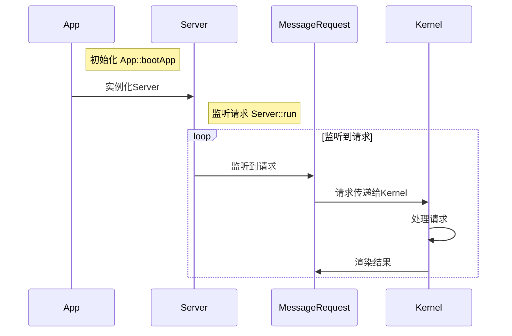
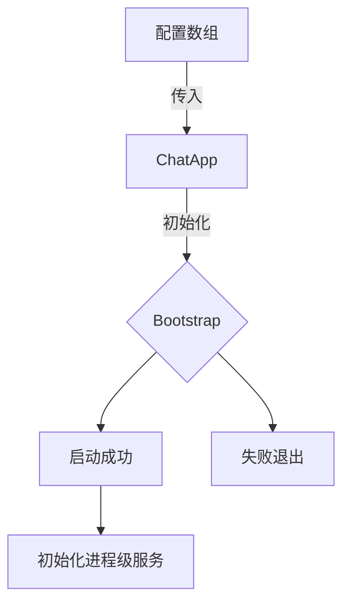
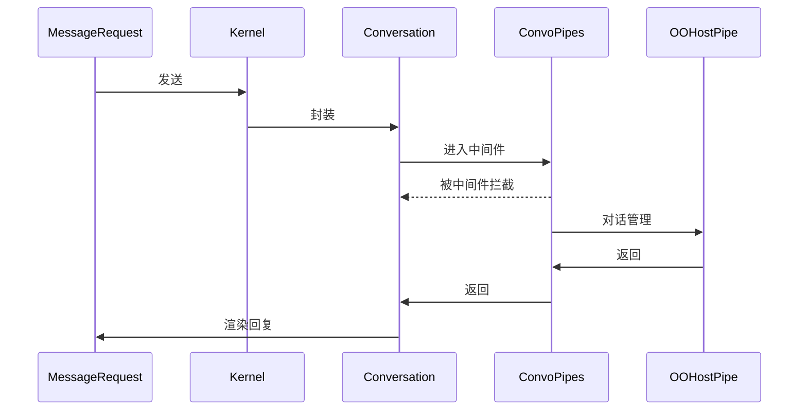
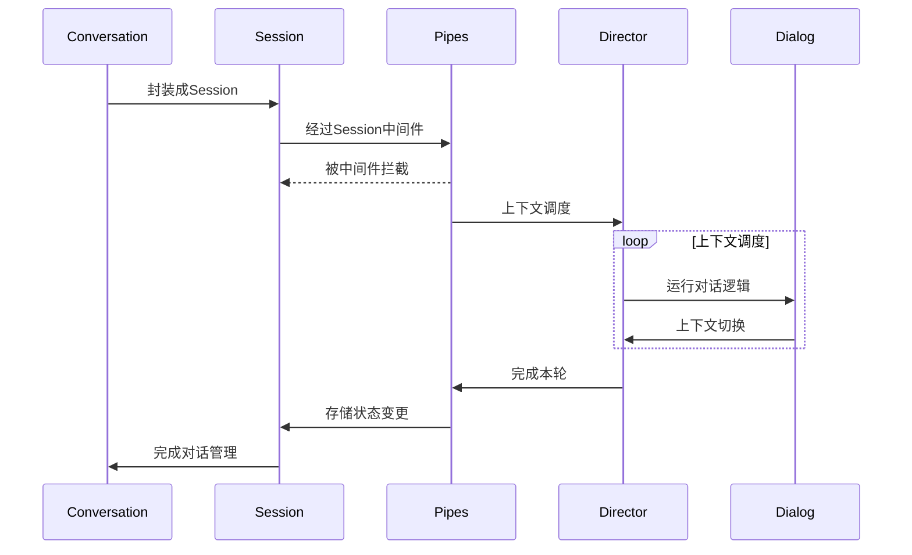

# 应用生命周期

要了解 CommuneChatbot 项目的生命周期, 最好的办法是[追踪源代码](https://github.com/thirdgerb/chatbot/blob/master/demo/console.php).

```php
<?php

require_once __DIR__ .'/../vendor/autoload.php';

// 将第一个参数作为 scene
$scene = $argv[1] ?? '';
$_GET['scene'] = $scene;

$config = include  __DIR__ . '/configs/config.php';
$config['processProviders'] = [
    \Commune\Chatbot\App\Platform\ReactorStdio\RSServerProvider::class,
];

// 将配置数组传入 ChatApp, 获取应用实例
$app = new \Commune\Chatbot\Framework\ChatApp($config);
$app->getServer()->run();
```

## 关键概念

__Application__ : 系统的根应用, 所有的运行基于它开始.

__Server__ : 服务端实例, 用于监听用户消息. 消息可以来自命令行, tcp, http等等.

__Kernel__ : 处理请求的内核, 每个请求都由 kernel 负责调度.

__ServiceProvider__ : 服务提供者, 用于将服务注册到控制反转容器中, 从而允许依赖注入的方式调用. 详见 [双容器策略与依赖注入](/docs/engineer/di.md)

__进程级容器__ : 整个进程共用的控制反转容器, 保存了进程内共享的所有服务的单例. 详见[双容器策略与依赖注入](/docs/engineer/di.md)


__Chat__ : 对话, 消息互通的双方, 或者多方(群聊)构成一个对话, 拥有共同的历史记录和上下文. 不同的对话所有信息都是隔离的.

__ChatbotName__ : 机器人的名字, 用来识别机器人的唯一ID. 即便部署在多个端 (微信,qq,网页版), 只要 ChatbotName 一致, 就共享记忆.

__Conversation__ : 单轮对话. 将单轮对话的所有数据和服务, 封装成了一个请求级容器 Conversation. 详见[双容器策略与依赖注入](/docs/engineer/di.md)

__Session__ : 会话, 一次完整的多轮对话内容, 封装了上下文记忆和语境. 会话可以因为主动结束, 或等待太久过期而更新. 一个 Chat 有若干次的 Session, 每个 Session 都有若干次单轮对话 Conversation.

__Dialog__ : 对话管理者 (dialog manager), 封装了对话管理相关的各种 api, 相当于 ```javascript```开发中的```window```对象.

__Context__ : 上下文语境. 标记了对话所处上下文的位置, 存储了记忆信息, 封装了回复和上下文切换的逻辑.


## 应用时序图



## 应用初始化

CommuneChatbot 的根应用是 ```Commune\Chatbot\Framework\ChatApp```, 实现了接口 ```Commune\Chatbot\Blueprint\Application```.

在调用 ```Application::getServer()``` 以获取服务端实例时, 会先调用```Application::bootApp()``` 方法来初始化应用.

应用的初始化流程如下:



配置数组的结构请参考 ```Commune\Chatbot\Config\ChatbotConfig```, 使用了基于```Commune\Support\Option``` 的配置体系, 将数组封装为对象单例来使用. 具体方法请参考 [配置体系](/docs/engineer/configuration.md).

而 ```bootstrap``` 环节用到了若干个 ```Commune\Chatbot\Framework\Bootstrap\Bootstrapper``` 对象来执行启动所需的方法, 它们定义在```Commune\Chatbot\Framework\ChatApp::$bootstrappers``` 中, 具体的作用如下:

```php
    // 和用户打招呼
    Bootstrap\WelcomeToUserChatbot::class,
    // 加载预定义的配置.
    Bootstrap\LoadConfiguration::class,
    // 注册用户的 service provider
    Bootstrap\RegisterProviders::class,
    // 注册组件
    Bootstrap\LoadComponents::class,
    // 检查必要的服务是否注册完成.
    Bootstrap\ContractsValidator::class,
```

启动的最后一步是 "初始化进程级服务", 相关的内容请参考 [双容器策略与依赖注入](/docs/engineer/di.md).

## 请求生命周期

在执行了 ```Server::run()``` 方法之后, 应用就会监听请求. 如果是在 [studio-hyperf 工作站](https:://github.com/thirdgerb/studio-hyperf) 中启动的, 会为每一个请求分配一个独立的协程任务去处理, 以实现异步IO下的同步非阻塞请求, 实现高并发. 相关原理请查看 [swoole 协程文档](https://wiki.swoole.com/wiki/page/p-coroutine_realization.html).

请求的整个处理流程如下:



所有的请求中间件定义在 ```Commune\Chatbot\Config\Children\ChatbotPipesConfig``` 数组中, 可以通过```$chatbotConfig->chatbotPipes->onUserMessage``` 获取.

系统默认的中间件如下:

```php
    // 管理所有的异常, 发送消息
    MessengerPipe::class,
    // 阻塞会话 chat, 避免同时接受多个消息产生歧义
    ChattingPipe::class,
    // 多轮对话管理
    OOHostPipe::class
```

关于管道中间件的实现, 可查阅[管道文档](/docs/engineer/pipeline.md). 您可以按需设计自己的中间件加入进去, 例如:

* 存储输入输出消息到数据库的中间件
* 根据请求内容, 分别发送给监听其它 tcp 端口的多个机器人, 从而变成中控

## 对话管理生命周期

进入到```Commune\Chatbot\OOHost\OOHostPipe```后, 才进入多轮对话管理的内核.

```Host``` 是接待员的意思, 表示多轮对话管理内核, 参考了美剧西部世界. ```OO-Host``` 表示用 "面向对象风格" 实现的对话管理内核, CommuneChatbot 未采用的方案还有 "函数式风格内核", "事件机制内核", "路由式内核".

对话管理的生命周期如下:



Session 的 pipes (中间件管道) 定义在配置 ```Commune\Chatbot\Config\Children\OOHostConfig::$sessionPipes``` 中. 默认的管道如下:

```php
    // 事件类消息的转义
    SessionPipe\EventMsgPipe::class,
    // 将特殊标记转化为意图的中间件. 用于测试.
    SessionPipe\MarkedIntentPipe::class,
    // 用户命令
    Commands\UserCommandsPipe::class,
    // 管理员命令
    Commands\AnalyserPipe::class,
    // 导航类意图的中间件. 拥有最高优先级
    SessionPipe\NavigationPipe::class,
```

CommuneChatbot 使用```Director + Navigator``` 的方式实现上下文栈的调度, 以降低 PHP 函数调用的深度. 具体实现请看```Commune\Chatbot\OOHost\Directing\Director```.