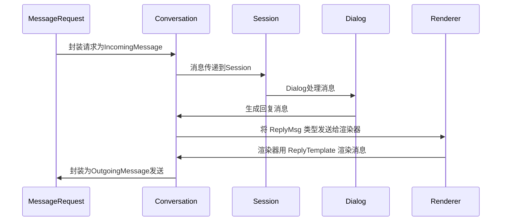
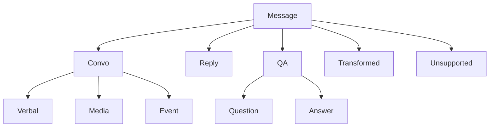

# 消息体系

CommuneChatbot 对各种平台传递来的信息做了统一的抽象, 通过这种方法实现多平台的适配.

## 1. 消息的生命周期



## 2. 常用消息

CommuneChatbot 最常用到的消息有两种 :

* 纯文本
    - 对应类 ```Commune\Chatbot\App\Messages\Text```
    - 用来定义字符串的输入和输出.
* 回复消息
    - 对应类 ```Commune\Chatbot\App\Messages\Replies\Reply```
    - 用来定义回复消息, 通常表示为 ```(string)replyId + (array)slots```.
    - 系统会用回复模板对回复消息进行渲染.

其它所有可用的消息类型定义在命名空间 ```Commune\Chatbot\App\Messages``` 之下.

在了解了 CommuneChatbot 消息体系的接口设计之后, 您可以按需定义自己的 message.


## 3. 消息体系的接口设计

CommuneChatbot 是通过```interface```来设计消息体系的. 基本结构如下:



* ```Commune\Chatbot\Blueprint\Message\Message``` : 消息的底层抽象
    *   ```Commune\Chatbot\Blueprint\Message\ConvoMsg``` : 可在平台上传输的消息
        *   ```Commune\Chatbot\Blueprint\Message\MediaMsg``` : 多媒体消息
        *   ```Commune\Chatbot\Blueprint\Message\EventMsg``` : 事件类消息
        *   ```Commune\Chatbot\Blueprint\Message\VerbalMsg``` : 文字类消息
    *   ```Commune\Chatbot\Blueprint\Message\ReplyMsg``` : 系统回复
    *   ```Commune\Chatbot\Blueprint\Message\TransformedMsg``` : 对输入消息进行二次封装.
    *   ```Commune\Chatbot\Blueprint\Message\QA``` : 问答类消息
        *   ```Commune\Chatbot\Blueprint\Message\QA\Question``` : 作为 ```ReplyMsg``` 的问题
        *   ```Commune\Chatbot\Blueprint\Message\QA\Answer``` : 作为 ```TransformedMsg``` 的回答
    *   ```Commune\Chatbot\Blueprint\Message\UnsupportedMsg``` : 系统当前不支持的消息
    *   ```Commune\Chatbot\OOHost\Context\Context``` : 上下文语境也被视作一种消息, 不可传输


### 3.1 Message

所有消息的底层抽象是 ```Commune\Chatbot\Blueprint\Message\Message```. 具体设计请查看接口类. 其中值得特别介绍的几个方法:

__DeliverAt__ : 定义消息需要发送的时间. 如果平台实现了消息管道或者双工, 则消息只有到发送时间之后, 才能够发送出去.

__getText__ : 任何类型的消息, 都必须给出一种字符串输出.

__getTrimmedText__ : 去掉了字符串两边空格和符号的文本.

__getCmdText__ : 如果消息可以被表示为一个 shell 风格的命令, 就能获得该字符串

__toMessageData__ : 将消息数据转化为数组

__namesAsDependency__ : 这个消息依赖注入时可以用的类型描述, 包括类名, 父类中的接口和抽象类.


### 3.2 ConvoMsg

ConvoMsg 指的是可以在对话中传输的消息, 接口类是 ```Commune\Chatbot\Blueprint\Message\ConvoMsg```. 这类消息直接来自请求, 也可以直接发送给请求. 不可传输的消息, 平台应该拒绝渲染.

ConvoMsg 分为三类:

* EventMsg : 事件类消息
* MediaMsg : 多媒体类型的消息
* VerbalMsg : 文字类型的消息

所有 ConvoMsg 都需要实现 ```public static function mock()``` 方法, 用于产生一个可用于测试的实例. 这样就可以进行统一的单元测试.

系统自带一个单元测试基类 ```Commune\Chatbot\App\Messages\ConvoMsgTesting```, 继承此基类的单元测试, 可以用 ```PHPUnit``` 对已注册的消息类型进行基础的测试. 推荐自定义的消息类型, 都自建相关自动测试用例.


#### 3.2.1 VerbalMsg

文字类型的消息. 对话机器人主要打交道的对象. 最基本的 VerbalMsg 是 ```Commune\Chatbot\App\Messages\Text```.

VerboseMsg 都允许传入消息级别 (```VerbalMsg::withLevel(string $level);```) , 级别的概念与```Psr\Log\LogLevel```相似, 允许客户端用不同颜色渲染字体, 或者语音解析时加入语气.

默认级别如下:

```php
interface VerbalMsg extends ConvoMsg
{
    //默认的消息级别
    const DEBUG = Speech::DEBUG;
    const INFO = Speech::INFO;
    const NOTICE = Speech::NOTICE;
    const WARN = Speech::WARNING;
    const ERROR = Speech::ERROR;
```

#### 3.2.2 MediaMsg

多媒体类型的消息. 比如音频, 图片, 视频, 座标等. 多媒体文件通常不是以文件形式传输的, 而是以资源地址字符串 "url" 的方式传递.

当前版本只实现了最基本的音频和图片 :

* ```Commune\Chatbot\App\Messages\Media\Audio```
* ```Commune\Chatbot\App\Messages\Media\Image```


#### 3.2.3 EventMsg

客户端发来的事件信号. 服务端可以专门处理, 也可以不做任务回复. 事件类消息不会触发默认的拒答 (可查看 Commune\Chatbot\OOHost\Dialogue\Hearing\HearingHandler::end).

* 连接事件 : ```Commune\Chatbot\Blueprint\Message\Event\Connect```
    - 告知通道已创建连接, 往往要重新与用户对话.
    - 通常对应 ```Commune\Chatbot\OOHost\Dialogue\Dialog::repeat```
* 开启会话 : ```Commune\Chatbot\Blueprint\Message\Event\StartSession```
    - 从头开始一个 session 的通知事件
    - 通常对应 ```Commune\Chatbot\OOHost\Dialogue\Dialog::home```
* 结束会话 : ```Commune\Chatbot\Blueprint\Message\Event\EndSession```
    - 关闭一个 session 的通知事件
    - 通常对应 ```Commune\Chatbot\OOHost\Dialogue\Dialog::quit```
    - 会触发```Commune\Chatbot\Config\Children\DefaultMessagesConfig``` 中定义的告别语

系统默认通过 ```Commune\Chatbot\App\SessionPipe\EventMsgPipe``` 类来处理事件消息. 您可以根据实际需求, 创建自己的中间件来取代它.

### 3.3 ReplyMsg

多轮对话内核可以直接将 ```ConvoMsg``` 作为回复发送给用户. 但更多的情况下, 内核发送的只应该是抽象. 这样可以用其它模块 (比如翻译模块), 将```Commune\Chatbot\Blueprint\Message\ReplyMsg``` 渲染成若干个```ConvoMsg```.


这样做的好处很多, 例如 :

* 允许使用支持 i18n 的```Commune\Chatbot\Contracts\Translator```
* 允许将消息翻译成可以点击的卡片
* 允许同一个消息, 在文字平台, 语音平台或其它平台渲染出不同的结果. 

所以```ReplyMsg``` 由两组参数构成 :

* ReplyId : 回复消息的唯一ID, 用于决定渲染所用的模板
* Slots : 渲染时可能用到的相关参数

详细渲染原理, 请看 [回复渲染](/docs/engineer/replies.md) 一节.

### 3.4 TransformedMsg

对输入消息进行二次封装后获得的新消息 (包含原来的消息体). 例如通过某些中间件, 将语音文件或图片文件 (例如表情包) 翻译成文字.

常用 TransformedMsg :

*   ```Commune\Chatbot\App\Messages\Recognitions\VoiceRecognition```
    *   语音识别类型的消息
    *   例如微信公众号的语音识别
*   ```Commune\Chatbot\OOHost\Command\CommandMessage```
    *   对命令格式的文字输入 (例如```#rm -rf /```)进行解析后, 拿到的对象.
    *   使用 ```Hearing::isCommand``` 命中条件后, 传入的就是这个对象
    *   [命令模块](/docs/dialogue/command.md) 也将此对象作为参数
*   ```Commune\Chatbot\App\Messages\ArrayMessage```
    *   对文字输入抽取关键信息后, 解析成数组式的对象
    *   使用 ```Hearing::pregMatch``` 会将正则匹配到的参数放入这个对象中.


### 3.5 问答类消息

问答是机器人引导用户展开对话最核心的形式. 通常是机器人抛出问题, 同时给出回答建议, 而用户给出答案.

```Commune\Chatbot\Blueprint\Message\QA\Question``` 是一个需要渲染的 ```ReplyMsg```.

而```Commune\Chatbot\Blueprint\Message\QA\Answer``` 则是一个需要渲染的回复消息.

具体情况请看 [问答模块](/docs/dialogue/qa.md).


### 3.6 UnsupportedMsg

标记请求传入的消息暂时无法处理. 这类消息不会传入多轮对话内核, 会在```Commune\Chatbot\App\ChatPipe\MessengerPipe``` 被拦截掉.

### 3.7 Context

Context 是上下文语境, 并不是可以传输的消息 (ConvoMsg). 但也可以理解为多轮对话之后产生的复杂消息, 从而允许处理消息的模块 (例如```Hearing```) 也将 Context 作为参数.

## 4. Message 与 ConversationMessage

```Commune\Chatbot\Blueprint\Message\Message``` 是对消息本身 (文字, 图片, 语音等) 的抽象.

```Commune\Chatbot\Blueprint\Conversation\ConversationMessage``` 在消息之上, 还保留了会话相关的其它信息, 例如 :

* __getId__ : 所有消息在系统中有全局唯一ID
* __getTraceId__ : 标记调用链条, 方便排查问题
* __getChatId__ : 用于区分不同的对话流的唯一ID, 可以标记1对1, 或者群聊
* __getSessionId__ : 标记一次完整多轮对话的唯一ID. 过期后将从头开始
* __getUserId__ : 消息用户一方的ID
* __getChatbotName__ : 消息机器人一方的名称, 定义在 ChatbotConfig

由于```ConversationMessage``` 可能是用户发给机器人的, 也可以是机器人发给用户的, 所以又分为:

* ```Commune\Chatbot\Blueprint\Conversation\IncomingMessage``` : 发送给机器人的消息
* ```Commune\Chatbot\Blueprint\Conversation\OutgoingMessage``` : 机器人发出去的消息


