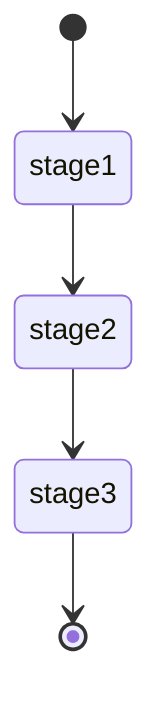
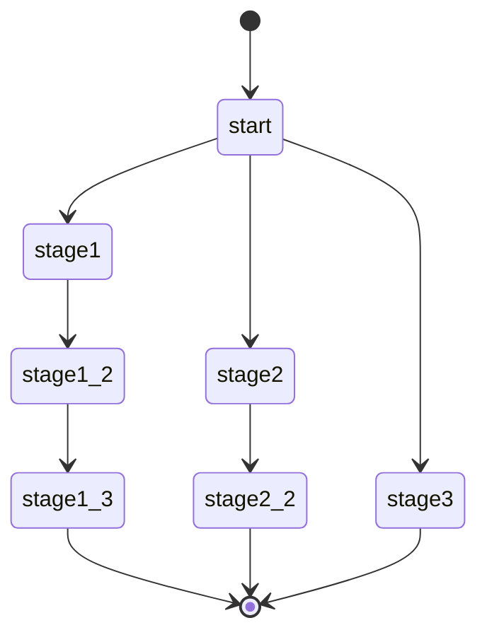
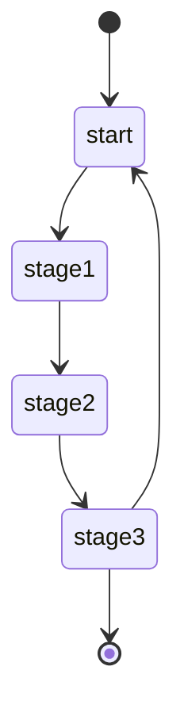
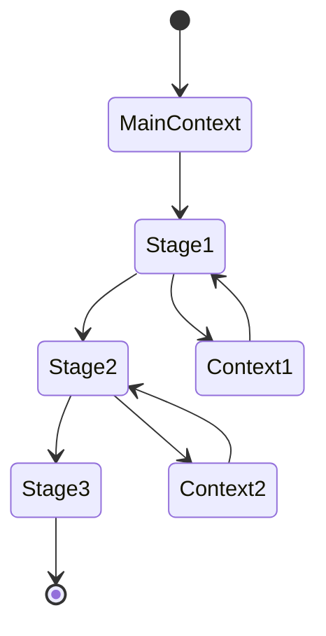
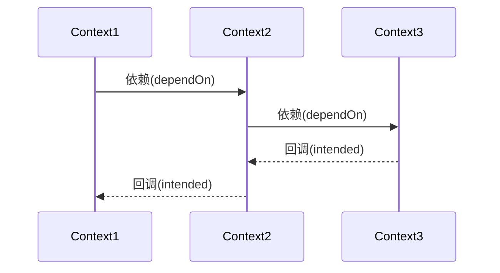
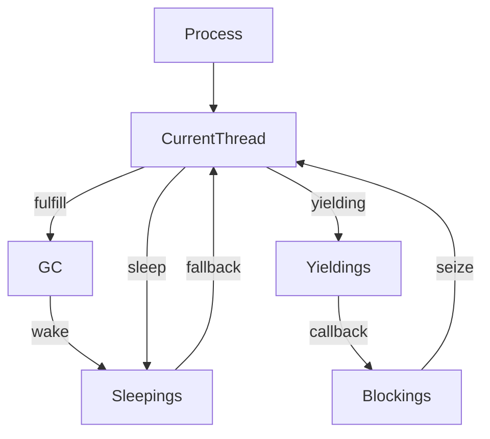

# 多轮对话生命周期

无论用工程化的手段, 还是用别的方法来实现多轮对话, 都应该对多轮对话的生命周期有完整的理解. 对

于复杂多轮对话问题, CommuneChatbot 项目给出了一整套工程模型, 从简单到复杂逐步推荐, 呈现逐阶提升的复杂多轮对话的组织方案, 在本文中介绍.

## 单轮对话

单轮对话实现了对用户输入信息的响应. 单轮对话机器人本质上是单轮对话的无限循环, 对话之间缺乏上下文联系与记忆, 例如最常见的闲聊机器人.

单轮对话是多轮对话的基石. 在 CommuneChatbot 项目中用 ```Stage``` 来定义单轮对话:

```php
    public function __onStart(Stage $stage) : Navigator
    {
                // 用链式调用来定义单轮对话
        return $stage->buildTalk()

            // 机器人向用户提问
            ->askChoose('请问您需要什么', ['a', 'b', 'c'])

            // 当听到用户消息的时候
            ->hearing()

            // 如果命中了选项
            ->isAnswer(function(Dialog $dialog, Answer $answer){
                $result = $answer->getResult();
                $dialog
                    ->say()
                    ->info('您选择 %result%', ['result' => $result]);

                // 重复单轮对话
                return $dialog->repeat();
            })

            ->end();
    }

```

多轮对话也是由一个个单轮对话构成的, 只是其中任何一个单轮对话节点(```Stage```), 根据用户的消息, 可以把对话引导到别的节点.

## 单向多轮对话

如果机器人和用户的对话有严格步骤, 这是一个单向的多轮对话. 这种多轮对话最为简单常见, 例如:

```
机器人: 请问您要什么口味的 // stage1
用户: 苹果味的
机器人: 要不要加冰 // stage2
用户: 加
机器人: 是杯装还是碗装? //stage3
用户: 杯子好了
```

流程图:



这样有上下文的多轮对话, 在 CommuneChatbot 项目中称之为 ```Context```, 其中包含上下文相关记忆, 每一个单轮对话的逻辑, 退出的规则等. 写成伪代码:

```php

class SimpleContext extends Context
{
    public function __onStage1(Stage $stage) : Navigator
    {
        return $stage->talk(
            ...
            function(Dialog $dialog) {

                // 前往 stage 2
                return $dialog->goStage('stage2');
            }
        );
    }

    public function __onStage2(Stage $stage) : Navigator
    {
        return $stage->talk(
            ...
            function(Dialog $dialog) {

                // 前往 stage 2
                return $dialog->goStage('stage3');
            }
        );
    }

    public function __onStage3(Stage $stage) : Navigator
    {
        ...
    }
}

```

或是干脆把多个 stage 组合成管道


```php

class SimpleContext extends Context
{
    public function __onStart(Stage $stage) : Navigator
    {
        // 预定义好要经过的管道
        return $stage->dialog->goStagePipes([
            'stage1',
            'stage2',
            'stage3'
        ]);
    }

    public function __onStage1(Stage $stage) : Navigator
    {
        return $stage->talk(
            ...,
            function(Dialog $dialog) {
                ...

                // 用 next 方法进入下一个单元
                // 如果下一个 stage 不存在, 则结束多轮对话.
                // 这样定义一个 stage 时不需要耦合上下文.
                return $dialog->next();
            }
        );
    }

    public function __onStage2(Stage $stage) : Navigator { ... }

    public function __onStage3(Stage $stage) : Navigator { ... }
}

```

显而易见, 只要以下几个参数就能标记多轮对话的当前位置了 :

- contextId : 当前对话语境的唯一ID
- stage : 对话进行到的步骤名称.
- stacks : 接下来要经过的步骤构成一个栈

这样的数据结构在 CommuneChatbot 项目中用 ```Commune\Chatbot\OOHost\History\Node``` 对象来记录.

许多基于 slot filling (填槽) 的任务型多轮对话, 就是实现了一个单向的多轮对话.

## 有分支的多轮对话

既然一个 Stage 可以指定下一个要到达的 Stage, 它也可以指定若干个可能前往的 stage. 从而出现了分支.




写成伪代码:

```php

class BranchContext extends Context
{
    // 定义一个起点
    public function __onStart(Stage $stage) : Navigator
    {
        // 用链式调用来定义 stage
        return $stage->buildTalk()

            // 要求用户选择
            ->askChoose(
                '请选择您要的路线',
                ['路线1', '路线2', '路线3']
            )

            ->hearing()

            // 用户选择了第一条路, 指定路线
            // Redirector::goStageThrough 自动生成闭包
            // 等价于 $dialog => $dialog->goStagePipes([])
            ->isChoice(0, Redirector::goStageThrough(['stage1', 'stage1_2', 'stage1_3']))

            // 用户选择第二条路
            ->isChoice(1, Redirector::goStageThrough(['stage2', 'stage2_2'])

            // 用户选择第三条路
            ->isChoice(2, Redirector::goStage('stage3')

            ->end();
    }
}

```


## 有循环的多轮对话

多轮对话既然有了分支节点, 同样的原理就可以实现循环节点.



写成伪代码:

```php

/**
 * @property int $turns  定义循环的次数, 作为上下文记忆
 */
class LoopContext extends Context
{
    // 定义一个起点
    public function __onStart(Stage $stage) : Navigator
    {
        // 循环次数加一, 自动记忆到上下文中.
        $this->turn = $this->turn + 1;

        // 依次走若干个节点
        return $stage->dialog->goStagePipes(['stage1', 'stage2', 'stage3']);
    }

    ... // 省略中间单轮对话的定义

    public function __onStage3(Stage $stage) : Navigator
    {
        // 如果大于 5 轮
        if ($this->turns > 5 ) {

            // 结束这个多轮对话.
            return $stage->dialog->fulfill();
        }

        // 否则回到起点.
        return $stage->dialog->goStage('start');
    }
}

```

##  多轮对话

一个漫长的多轮对话, 可能有各种原因让多轮对话中断退出. 常见的中断原因有 :

- cancel : 用户或机器人主动取消对话
- reject : 用户没有权限继续
- failure : 流程中出现了无法继续下去的故障

中断后的常见策略有:

- quit : 结束对话
- restart : 对话重新开始
- 指定一个具体的 stage, 试图通过新的多轮对话流程来修复问题.

对于一个最基础的多轮对话而言, 中断策略是全局共享的. 任何一个节点退出都由全局来捕获处理.

```php

class SimpleContext extends Context
{
    ...

    public function exiting(Exiting $listener) : void
    {
        $listener
            ->onCancel(...)   // 取消的逻辑
            ->onFailure(...)  // 故障的逻辑
            ->onReject(...)   // 无权限时的逻辑
            ->onFulfill(...); // 正常结束时的逻辑
    }
}
```

## 分形的多轮对话

由单轮对话构成多轮对话, 再加上分支和循环, 一个初步的复杂多轮对话就成型了. 理论上它可以无限轮次.

例如用户和机器人围绕各种需求对话了几千轮, 共涉及一千个处理独立功能的单轮对话节点.这么多节点定义在一个 Context 中, 它会不可思议的巨大, 而且无法维护.


所以我们要像编程语言那样用分形的结构拆分和封装多轮对话. ```Stage``` 相当于函数, ```Context``` 相当于类, 而我们要把上万行的代码拆分到几百个相互调用的类与函数中.

于是多轮对话的状态就变成了这样 :



写成伪代码 :

```php

class MainContext extends Context
{
    public function __onStart(Stage $stage) : Navigator
    {
        return $stage->dialog->goStage('stage1');
    }

    public function __onStage1(Stage $stage) : Navigator
    {
        // 当前 stage, 依赖另一个多轮对话完成
        // 当另一个多轮对话完成时, 会回调当前 stage
        // 并用 Context1 作为参数
        return $stage->dependOn(

            // 用名称指定跳转的多轮对话
            'Context1',

            // 回调方法, 跳转到 stage2
            Redirector::goStage('stage2')
        );
    }

    public function __onStage2(Stage $stage) : Navigator
    {
        return $stage->dependOn(

            // 用名称指定跳转的多轮对话
            'Context2',

            // 回调方法, 跳转到 stage3
            Redirector::goStage('stage3')
        );
    }

    public function __onStage2(Stage $stage) : Navigator
    {
        // 结束 MainContext
        return $stage->dialog->fulfill();
    }

}
```

由于 Context1 和 Context2 还可以继续依赖别的 Context, 用这种形式可以实现简单的分形的封装和复用.

## 依赖关系构成 Thread 栈

上一步实现了多轮对话的分形拆分, 展开来还是同一个有分支和循环的长程多轮对话.

在对话的过程中很可能出现 Context1 依赖 Context2, Context2 依赖 Context3 ... 当被依赖的 Context 完成之后, 会一层层地回调, 从而构成一个栈结构.



这样的栈结构在 CommuneChatbot 中通过 ```Commune\Chatbot\OOHost\History\Thread``` 对象来表示.

最大的特点是, 依赖关系不仅接受层层回调, 而且共享中断机制. 遇到```cancel, failure, reject```等事件时, 也会冒泡式地层层回调. 任何一层如果拦截了事件, 可以自己定义重定向的 stage.

## 非依赖关系构成堆结构

在自然对话中, 很可能出现各种情况, 例如插入一个话题, 使得多轮对话 A 到多轮对话 B 并不是依赖关系的. 多轮对话 B 无论正常结束还是异常结束, 都需要 A 来继续话题.

例如:

```
机器人: 请问要什么口味的
用户: 苹果的
机器人: 请问是否要加冰
    用户: 稍等, 请问有没有会员折扣?  // 用户跳到了另一个对话场景
    机器人: 我们这里有会员折扣, 需要您...
    用户: 算了, 不用了
    机器人: 好的. // 对话场景 cancel 掉了
机器人: 请问是否要加冰 // 另一个对话结束后, 回到当前对话
```

类似这种非依赖关系, CommuneChatbot 会建立一个由 Thread 组成的 ```sleeping```堆, 多轮对话切换时, 当前 Thread 进入 ```sleep```堆, 而新的多轮对话 Thread 会掌握控制权. 而当新的 Thread 结束时, 会从 ```sleeping```堆中唤醒最近一个 Thread 来获取控制权.

```php

    public function __onStageN(Stage $stage) : Navigator
    {
        return $stage->sleepTo(
            // 跳转的目标 Context
            'TargetContext',

            // 被重新唤醒时的回调方法
            function() {}
        );
    }
```


## 异步任务下的让出与抢占

现有的大多数对话机器人, 在实现任务的时候是采用同步逻辑. 如果对话机器人要推进到生产领域, 会出现大量的异步逻辑.

简单而言, 一个任务需要经过一段时间之后才会进入下一阶段, 这段时间不需要用户等待, 而是可以先和机器人对话别的事情. 等到任务阶段性完成后, 再抢占当前的多轮对话.

CommuneChatbot 对此有完整的实现机制, 但尚未实装. 简单而言:

1. 当前 Thread 让出控制权, 进入```yielding```状态. 等待服务回调.
2. 一个指定的 Thread, 或者 sleeping Thread 获得对话控制权.
3. 当 ```yielding``` 状态的 Thread 接受到回调后, 移动到 ```Blocking```栈, 按优先级排序.
4. 下一轮对话时, 如果 ```Blocking```栈有 Thread, 会将当前 Thread 推到 sleeping 堆中, 然后让 Blocking 的 Thread 抢占控制权.
5. Thread 存在优先级, Blocking Thread 优先级低则不能抢占当前对话, 避免多个任务同时回调, 不断抢占.

这个功能计划在未来有实际业务场景的时候, 再在未来的版本里实装.


## 对话进程 Process

基于上述内容可知, 一个多轮对话中可能同时存在若干个 Thread, 分布在不同的位置:

- Current : 当前 Thread, 拥有对话控制权
- Sleeping : 等待被唤醒
- Yielding : 等待回调
- Blocking : 排队要抢占 Current 的位置

完全不在上下文中的 Thread 则会被垃圾回收 (GC), 然后唤醒一个 Sleeping Thread.




这整个数据结构, 构成了一个多轮对话的完整上下文关系, 在 CommuneChatbot 项目中是通过 ```Commune\Chatbot\OOHost\History\Process``` 对象来表示的.

对 Process 的各种操作, 都封装到了 API ```Commune\Chatbot\OOHost\History\History``` 类中. 而对于开发者, 则会再封装一层```Commune\Chatbot\OOHost\Dialogue\Dialog```用于撰写逻辑.

经过高层次的封装后, 开发者并不需要了解每一个状态变更的细节, 只需要定义单轮对话 Stage 就可以了.

```php

    // stage 1
    public function __onStage1(Stage $stage) : Navigator
    {
        return $stage->dependOn(

            // 依赖关系进入 Context1
            'Context1',

            // 回调时进入 stage2
            Redirector::goStage('stage2')
        );
    }

    // stage 2
    public function __onStage2(Stage $stage) : Navigator
    {
        return $stage->sleepTo(

            // sleep, 让 context2 获得控制权
            'Context2',

            // wake 时的逻辑
            Redirector::goStage('stage3')
        );
    }

```


用这样的方案, 已经可以用规则定义出一个非常复杂的 N 阶多轮对话了, 常见的应用场景大多能够实现.

就像我们程序员日常编程一样, 不用时刻记得所有的流程, 只需要正确定义每一个片段, 就能让多轮对话转动起来.

## 第一反应与场景

第一反应, 指用户与机器人开始对话, 机器人的第一反应. 可能是欢迎语, 或者自我介绍, 或者猜你想问.

对于同一个机器人, 往往用户从不同场景开启对话, 希望对话的内容也不一样. 以瓜子二手车的智能客服为例, 当用户在买车页打开智能客服, 主要想咨询买车事宜. 当用户从卖车页进入, 自然主要想咨询卖车信息.

CommuneChatbot 设计了 "场景" (```Scene```) 概念, 用户从不同 "场景" 进入, ```Commune\Chatbot\Blueprint\Conversation\MessageRequest::getScene()``` 的值也不一样, 如果在配置文件的 ```sceneContextNames``` 词典里定义了该场景的 Context, 则可以将开启对话的根语境切换为该场景.

这样同一个机器人, 就可以对每个不同的场景进行不一样的第一反应了.

## 子对话与多任务调度

上一段我们提到了, 每一个 ```Dialog``` 对象可以用于管理一个 Process. 一个 Process 对应一个复杂的多轮对话上下文状态.

而在现实对话中, 我们还可能遇到两种更高阶的对话组织形式.

- 对话嵌套
- 多任务调度

所谓 __对话嵌套__, 以 CommuneChatbot 的对话游戏 Demo 为例. 用户在玩一个 "大战长坂坡" 的对话游戏, 需要对游戏给出的选项进行选择. 但用户随时说 "菜单", 会进入到一个 "菜单" 的多轮对话; 而当用户说 "返回游戏", 又要返回到游戏原来的情景中.

简单来说, 对话的控制权需要被 "菜单对话" 和 "游戏对话" 共享, 又各自保持自己的对话状态.

而所谓 __多任务调度__, 则是指有若干个进行中的对话任务, 都拥有独立的上下文, 而用户可以按需切换, 就像在浏览器上切换不同的窗口一样.


CommuneChatbot 解决这种问题, 使用了```SubDialog``` 机制. 简单而言, ```Stage``` 可以开启一个自己独占的子对话 (```SubDialog```), 拥有独立的 Process, 像管道一样架在这个 subDialog 的上层:

```php
 /**
     *
     * 测试会话嵌套.
     * 测试子会话的各种功能.
     * 可以测试的点:
     *
     * 1. before : 父dialog 拦截到, 仍然进入子dialog
     * 2. stop  : 父dialog 拦截到, 不进入子dialog
     * 3. miss : 子dialog miss, 父dialog 返回拦截到
     * 4. quit : 子dialog quit, 父dialog 拦截到, 返回菜单.
     * 5. fulfill : 子dialog fulfill, 触发 quit
     * 6. next : 子dialog 切换stage, 直到触发 fulfill
     * 7. maze : 子dialog 进入迷宫游戏
     * 8. stage : 查看子dialog 的stage
     *
     * @param Stage $stage
     * @return Navigator
     */
    public function __onTestSubDialog(Stage $stage): Navigator
    {
        return $stage
            // 正常的stage事件.
            ->onStart(function(Dialog $dialog){
                $dialog->say()->info('sub dialog start');
            })
            ->onCallback(function(Dialog $dialog){
                $dialog->say()->info('sub dialog callback');
            })
            ->onFallback(function(Dialog $dialog){
                $dialog->say()->info('sub dialog fallback');
            })

            // 开启 sub dialog
            ->onSubDialog(
                $this->getId(),
                function(){
                    return new SubDialogCase();
                }
            )
            // 进入子会话之前.
            ->onBefore(function(Dialog $dialog){
                return $dialog->hear()
                    ->is('before', function(Dialog $dialog){
                        $dialog->say()->info('hit before');
                        return null;
                    })
                    ->is('menu', function(Dialog $dialog) {
                        $dialog->say()->info('stop sub dialog and go start');
                        return $dialog->restart();
                    })
                    ->heardOrMiss();
            })
            // 子会话 wait 时
            ->onWait(function(Dialog $dialog){
                $dialog->say()->info('sub dialog is wait');
                return $dialog->wait();
            })
            // 子会话 miss 时
            ->onMiss(function(Dialog $dialog){
                $dialog->say()->info('sub dialog miss match');
                return $dialog->hear()
                    ->is('miss', function(Dialog $dialog){
                        $dialog->say()->info('catch miss');
                        return $dialog->wait();
                    })
                    ->end();
            })

            // 子会话退出时.
            ->onQuit(function(Dialog $dialog){
                $dialog->say()->info('sub dialog want quit');
                return $dialog->restart();
            })
            ->end();
    }
```

这样, 当前的 Process 就像一个 ``` master process```,
只负责拦截与任务调度相关的意图, 其它的意图交给子对话(```SubDialog```)来处理.
这样可以在多轮对话中通过切换```Stage```, 从而切换多个```worker process```


## 多机器人调度

比多任务调度更高阶的对话组织形式, 就是多机器人调度了. 这个技术实现更加简单一些. 服务器上实装多个机器人实例, 用户直接面对的机器人起到一个 "中控" 的角色, 负责把消息投递给指定的机器人, 然后返回响应.

这种机制可以通过中间件的方式实现, 直接把一个 SessionPipe 做成路由器. 而其它机器人则变成了它接线的对象, 或者像其它对话机器人那样, 称之为 "技能".

这个机制预期在 CommuneChatbot 未来的版本中会给出成熟的封装.
