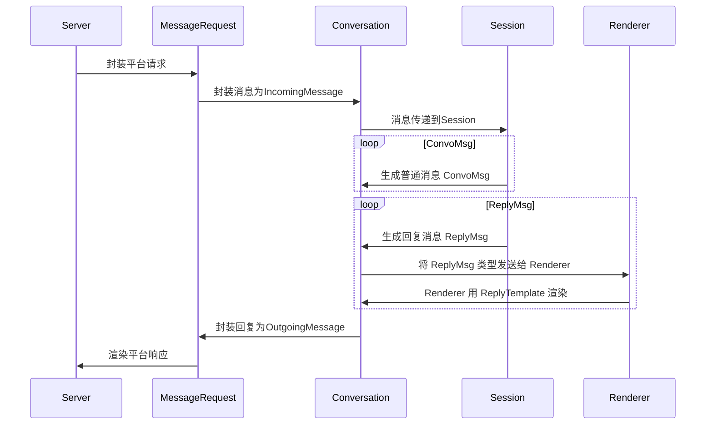
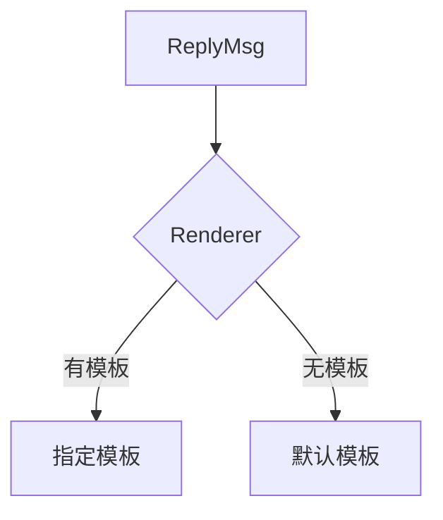

# 渲染回复

关于消息与回复的生命周期, 请查看[相关文档](/docs/engineer/messages.md). 本节主要介绍 CommuneChatbot 的回复渲染机制.

## 1. 消息的生命周期

用户和机器人对话, 机器人发送消息给用户, 存在两种机制:

* 被动回复 : 用户主动说完话, 机器人被动地, 同步地响应
* 主动回复 : 机器人主动推送消息给用户, 通常是任务的异步结果反馈

机器人主动发送消息, 如果是双工通道, 可以实时发送给用户. 否则, 通常用一个 Buffer 将异步消息缓存到队列里, 等到用户下一次请求时一起回复. 工作站 [studio-hyperf](https://github.com/thirdgerb/studio-hyperf) 所定义的消息队列是 ```Commune\Hyperf\Foundations\Contracts\MessageQueue```.

### 1.1 同步回复流程图



负责对平台请求进行封装的是```Commune\Chatbot\Blueprint\Conversation\MessageRequest```, 它继续要把平台请求 (platform request) 解析成 Message, 也需要把回复的 Message 渲染成响应 (platform response).

如果机器人回复的消息是 ```Commune\Chatbot\Blueprint\Message\ConvoMsg```, 将直接交给 MessageRequest.

如果是```Commune\Chatbot\Blueprint\Message\ReplyMsg```, 则会先通过```Commune\Chatbot\Blueprint\Conversation\Renderer``` 渲染一次, 得到若干个 Message, 然后再交给 MessageRequest 渲染响应.

### 1.2 二次渲染

CommuneChatbot 里发送消息会经过二次渲染:

* 回复渲染 (reply render) : 将 ReplyMsg 渲染成一般的 Message, 通常是 ConvoMsg.
* 平台渲染 (platform render) : 将 Message 渲染成平台的响应, 例如 Http response.

平台渲染主要的功能, 就是把各种平台 (微信, qq, 智能音箱等) 的输入输出, 统一抽象成为 CommuneChatbot 的 [消息体系](/docs/engineer/messages.md) , 从而实现一个机器人, 多端可用.

而回复渲染类似 MVC, MVVM 框架里的 View 层. 它的作用有 :

- 复用模板 : replyId + slots 类似函数名 + 参数, 可以复用代码
- 解耦模块 : 可以将某个服务, 例如自动生成回复的服务, 注册为回复模板
- 多端适配 : 同一个消息在不同平台可以渲染成不同结果, 例如语音平台渲染为SSML

## 2. 发送消息

CommuneChatbot 通过```Commune\Chatbot\Blueprint\Conversation\Conversation```来发送消息给用户. 有两种最基础的发送方式:

```php
    /**
     * @var Commune\Chatbot\Blueprint\Conversation\Conversation $convo
     * @var Commune\Chatbot\Blueprint\Message\Message $message
     * @var string $userId
     * @var bool $immediately
     * @var string|null $chatId
     */

     // 直接将回复发送到当前 chatId, 回复给发来消息的用户
     // $message 如果是 ReplyMsg, 则会触发渲染.
     $convo->reply($message);

     // 将回复发送给指定的Chat和指定的用户, 可以通过机器人搭桥实现人与人对话
     $convo->deliver(
        $userId,  // 用户的唯一ID
        $message, // 消息体
        $immediately, // 是立刻发送, 还是等请求结束时, 一起发送
        $chatId   // 可以指定 chatId, 为 null 的话用默认机制生成
     );
```

### 2.1 通过 Speech 发送 ReplyMsg

想要发送 ```Commune\Chatbot\Blueprint\Message\ReplyMsg``` 类消息, 最基础的方式是直接 new 一个出来:

```php

    // 回复消息的 ID
    $id = 'demo.hello.world';
    // 回复消息的参数
    $slots = new \Illuminate\Support\Collection([]);
    // 回复消息的级别, 类似 psr 的 logLevel
    $level = \Commune\Chatbot\Blueprint\Conversation\Speech::Info;

    // 定义一个最基础的回复消息.
    $reply = new \Commune\Chatbot\App\Messages\Replies\Reply($id, $slots, $level);

    /**
     * @var Commune\Chatbot\Blueprint\Conversation\Conversation $convo
     */

    // 发送回复消息
    $convo->reply($reply);
```

我们也可以使用 ```Commune\Chatbot\Blueprint\Conversation\Speech``` 里的方式进行链式调用, 减少代码量:

```php
   /**
    * @var Commune\Chatbot\Blueprint\Conversation\Conversation $convo
    */

    $replyId = 'demo.hello.world';
    $slots = [];

    $convo
        ->getSpeech()
        ->info($replyId, $slots)
        ->warning($replyId, $slots)
        ->error($replyId, $slots);
```

更多情况下, 我们并不直接使用 Conversation 来发送回复, 而是通过对话管理中的[Dialog](/docs/dm/dialog.md) 模块.

```php
    $dialog
        ->say($slots) // 共用的 slots
        ->info($reply1, $slots1)
        ->info($reply2, $slots2);
```

## 3. ReplyMsg 渲染机制

```Commune\Chatbot\Blueprint\Message\ReplyMsg```类型的回复消息会发送给```Commune\Chatbot\Blueprint\Conversation\Renderer```, 流程如下:



Renderer 根据```Commune\Chatbot\Blueprint\Message\ReplyMsg::getReplyId()``` 的值判断是否已经注册了渲染模板, 如果没有注册, 则调用默认的模板.

> 您完全可以跳过渲染机制, 直接用想要回复的文本作为 ReplyId. 例如 ```$dialog->say()->info('您好, 请问我有什么可以帮助您的?')```.

### 3.1 注册渲染模板

所有的回复渲染模板, 必须实现接口 ```Commune\Chatbot\Blueprint\Conversation\ReplyTemplate```, 并且注册到```Commune\Chatbot\Blueprint\Conversation\Renderer```中, 两者都是[进程级服务](/docs/engineer/di.md).

系统默认的渲染服务注册, 定义在```Commune\Chatbot\Framework\Providers\ReplyRendererServiceProvider```, 可查阅实现方式, 和默认的模板.

这个服务提供者定义在配置文件里, 对应系统配置```Commune\Chatbot\Config\ChatbotConfig``` 的 ```$chatbotConfig->baseServices->render```位置. 可以按需修改.

您也可以自定义服务注册类, 继承自```Commune\Chatbot\Framework\Providers\ReplyRendererServiceProvider```, 定义自己的渲染模板.


## 3.2 默认渲染模板

默认的渲染模板通常是 ```Commune\Chatbot\App\Messages\Templates\TranslateTemp```, 用于实现 i18n 多语言.

该模板使用了 i18n 模块 ```Commune\Chatbot\Contracts\Translator``` , 底层基于[symfony translator](https://symfony.com/doc/current/components/translation.html) 实现, 会查找 replyId 对应的文本内容, 否则直接渲染 replyId 字符串作为回复.

具体使用方式可以查阅 [symfony 相关文档](https://symfony.com/doc/current/components/translation.html). 这里举几个例子.

当没有配置 replyId 对应的文本时:

```php
    /**
     * @var Commune\Chatbot\Blueprint\Conversation\Conversation $convo
     */
    $convo
        ->getSpeech()

        //输出 'hello world'
        ->info('hello world')

        // 输出 'hello %world%'
        ->info('hello %world%')

        //输出 'hello guest'.
        ->info('hello %world%', ['world'=>'guest']);

```

Slots 中的参数 ```'world' => 'guest'```, 作为值渲染到了文本中的```%world%```.

然后, 如果我们配置了 replyId 对应的文本在 Translator 加载的资源文件 ```messages.php``` 里 :

```php
    return [
        'demo' => [
            'hello' => [
                'world' => 'hello {world}',
            ]
        ]
    ];
```

这时就可以用 ```demo.hello.world``` 的方式调用到已注册的文本了 :

```php
    $convo
        ->getSpeech()

        // 输出 'hello {world}'
        // 多维数组结构映射为链式写法.
        ->info('demo.hello.world')

        // 输出 'hello guest'
        ->info('demo.hello.world', ['world'=>'guest');

```


### 3.3 指定 translator 资源文件路径

CommuneChatbot 的```Commune\Chatbot\Contracts\Translator```模块底层使用了[symfony translator](https://symfony.com/doc/current/components/translation.html). 可以用 php, yaml, xliff 等多种方式加载资源文件. 默认使用 php 文件来定义.

系统默认的资源文件位置, 可以在基础配置```$chatbotConfig->translation``` 中定义. 配置具体结构请查看```Commune\Chatbot\Config\Children\TranslationConfig```.


### 3.4 按照 ICU 规范定义文本

许多象声文字在单复数, 序数词, 不同性别等情况下有不同的拼写. 例如英语脚是 "foot", 多只脚则是 "feet".

因此, 在解决 i18n 问题时, 有了 [ICU (International Component for Unicode)](http://site.icu-project.org/) 这样的通用解决方案.

Symfony Translator 支持 ICU, 这里是[具体使用文档](https://symfony.com/doc/current/translation/message_format.html#using-the-icu-message-format).

CommuneChatbot 默认支持 ICU, 这需要安装了 [PHP 扩展 intl](https://www.php.net/manual/en/book.intl.php).

因此, 在 Translator 的资源文件中定义变量时, 请遵照 ICU 的规范.

### 3.5 通过 ComponentOption 加载更多资源

所有通过 [ComponentOption](/docs/components.md) 注册的组件, 都可以预加载自己需要的 translation 资源文件.

```php

class MyComponent extends ComponentOption
{
    ...

    public function bootstrap()
    {
        ...

        $this->loadTranslationResource(
            $resourcePath,
            $formatType
        );
    }
}


```