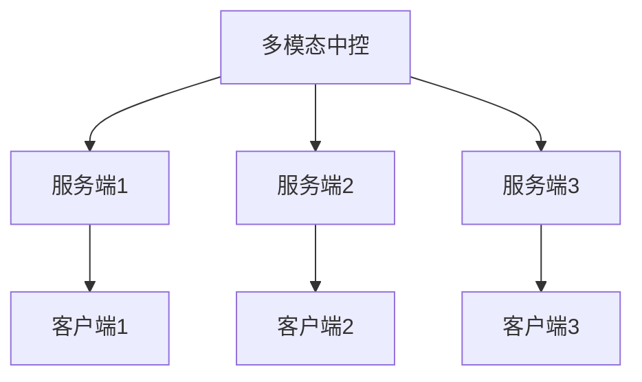
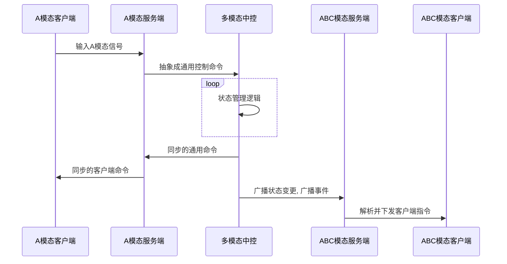

# 多模态中控

CommuneChatbot 首先作为 "对话管理机器人" 进行设计.
用户的输入信息, 最基本的抽象是 "intent" + "entity" (意图 + 实体参数).

然而 intent + entity 的抽象, 从来没有限定只能从 "自然语言" 中获得.
任何形式的输入, 包括 触控/姿势/开关 等, 都可以抽象成 intent + entity.
这时, CommuneChatbot 就不再是一个 __对话管理机器人__, 而变成了一个 __状态管理中控__, 从而可能具备多模态中控的能力.

本篇文章将讨论 CommuneChatbot 的架构作为多模态应用中控的方案和可行性.

## 什么是多模态交互

多模态 (模态: modality, 表示感官) 交互, 是指人类用户通过各种感官形式来与程序交互.
通常包括 "视觉", "声音", "接触" 等. 进一步细分, 可以有:

- 语音
- 动作捕捉
- 视觉追踪
- 键鼠输入
- 触屏

而进一步的, 通过 "客户端" 传输的信息也可以是多媒体的, 不限于文字, 还可以包括 图片/ 表情包/颜文字/视频/音频/触屏动作 等等.

也许从人的感官角度来定义 "多模态" 还不够准确, 应该从 "机器" 的 "感官" 角度来定义 "多模态", 更有意义一些.

人类与人类的交互从来都是多模态的. 可以预见, 人机交互从桌面电脑的 IO 设备 (屏幕, 触控, 鼠标, 键盘) 走向多模态, 是软件技术发展的必然趋势.

## 多模态交互应用

多模态交互应用, 通常指既有不同感官输入信息, 也从不同感官输出信息的应用.
它们很可能 __不再局限于单一设备__, 比如多种智能穿戴设备包括 智能眼镜/智能耳机/智能手表/可触摸屏幕 共同接受信号, 共同作用于同一个应用.

可见这样的应用, 最本质的特点是 __多个器官, 一个大脑__ . 或者更具体一点:

- 可对接多个设备的多个客户端
- 使用多种渠道进行通信
- 拥有同一的应用中控
- 应用中控维护各种设备的公共状态

而我们现在的各种应用, 往往分散在各个设备上, 通常有两种对接模式:

- IO设备 对接 有状态应用
- 有状态应用 对接 有状态应用

比如台式机的大脑在机箱里, 而 显示器/鼠标/键盘/音箱 等都是没有应用状态的 IO 设备.

而另一种情况, 例如 ```智能音箱 对接 智能手机```,
每个设备其实都有独立的 "大脑".
它们通过 API, 使用 "指令" 的形式进行交互.

这本质上是把状态同步交给人类自己去管理. 如果两个应用之间状态不同步, 就容易出现 "裂脑" 的现象.

多模态交互的应用, 我理解成集中管理原来各个分散设备上的有状态应用, 将状态统一集中到服务端, 只有一个 __大脑__, 而设备上最多只有 __小脑__. 任何一个设备 (模态) 的输入导致状态变更, 所有设备一起响应变更.

## 例子: 智能音箱 + 动态网页

我们可以想象一个具体的例子. 一个讲解员, 在大屏幕上投影一个类似 PPT 的网页, 他佩戴了一个智能蓝牙耳机, 旁边有一个共放的智能音箱.

讲解员对头戴的智能耳机说 "打开亚洲区的财务报表", 投影的网页自动进入该页面, 而智能音箱发出声音说 "请问需要查看哪个时段的数据", 讲解员回答后, 投影网页的数据也随之变化.

这就是一个 "网页" + "智能耳机", 或者说 "网页交互" + "语音交互" 公共作用的例子.


## 多模态应用架构设想

简单画一个多模态应用, 大概架构如下:



简单画一个通信的时序图如下:



可见这样的架构最基本的要求有以下几点:

- 跨平台的身份一致性
- 中控 统一的 控制命令 抽象层
- 中控 与 多模态服务端 之间的 广播机制
- 多模态服务端 与 客户端 的双工通信

多模态应用的状态管理中控, 并不直接给任何一个客户端下发 __指令__,
而是将 状态变更/响应动作 封装成事件, 用广播的形式下发.
每个模态自己的服务端做独立的渲染.


## 使用 CommuneChatbot 搭建多模态机器人

使用 CommuneChatbot 搭建多模态机器人, 理论上是可行的.

现在的官网 https://communechatbot.com 就提供了一个简单的 Demo 示范.

在网站通过 __对话界面__ 与 Web 机器人对话, 每次都会将对话状态变更 (contextName, stage) 下发给浏览器. 浏览器通过 Vue 开发的前端客户端会更新本地状态, 同时从 API 机器人拉取新的对话源码.

所以和 Web 机器人 对话的同时, 页面右上角 ```<>``` 图标点开显示的源代码也一直在变化.

另一方面, 点击对话界面上的侧边栏, 选项按钮, 都会转化为普通消息发送给 Web 机器人.

----

使用 CommuneChatbot 搭建真正的多模态对话机器人, 简单来说就是:

1. 用 CommuneChatbot 框架给每个模态的客户端搭建一个双工通信的服务端.
1. 服务端将该模态客户端输入信号, 解析为统一的 [Message 对象](/docs/engineer/messages.md)
1. 服务端将 Message 对象发送给用 CommuneChatbot 搭建的状态中控, 由它进行多轮交互的状态管理.
1. 状态中控返回同步信号给该服务端, 同时广播状态变更和响应事件给所有服务端
1. 收到广播的服务端, 将状态变更和响应事件, 通过双工通道发送给客户端
1. 服务端之间定期心跳, 同步状态, 避免裂脑.

这方案建立在 CommuneChatbot 项目:

1. 有统一的 [Message 抽象](/docs/engineer/messages.md)
1. 有统一的 [Intent + Entity 作为通用命令抽象](/docs/dm/intent.md)
1. 有 [多轮交互状态管理能力](/docs/dm-lifecircle.md)
1. 可用[管道搭建任意流程](/docs/engineer/pipeline.md)的机器人, 可将一个管道变为机器人之间的通信
1. 基于 Swoole, 方便搭建双工的服务端

未来会尝试开发具体的应用, 来验证这种多模态中控的设想.
