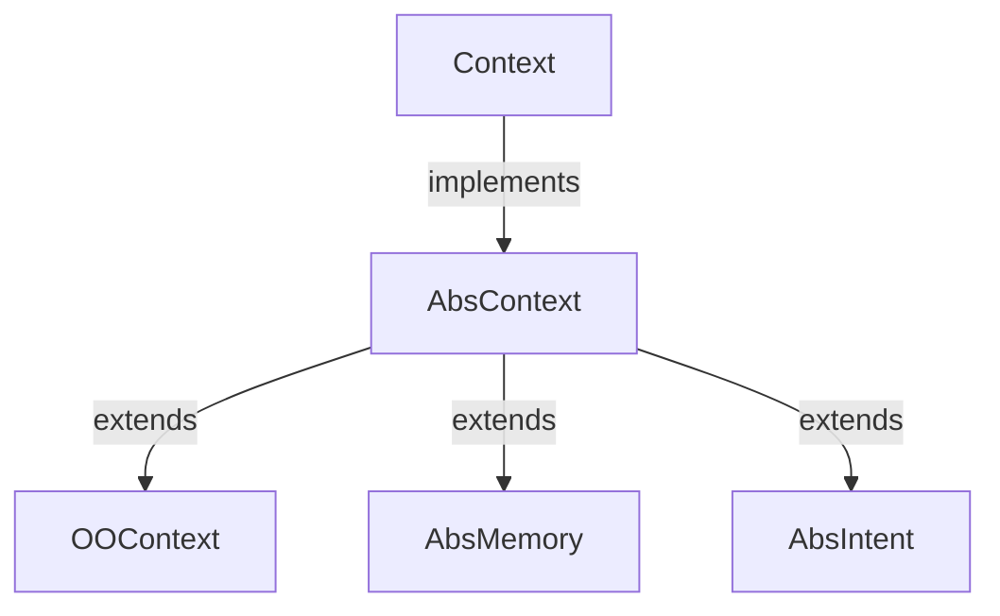

# Context

> 多轮对话的上下文, 本项目称之为 Context (中文为 "上下文" 或 "语境")
>
> 开始这一节前, 希望您已经通过 [多轮对话生命周期](/docs/dm-lifecircle.md) 这一节了解了 CommuneChatbot 的复杂多轮对话工程模型.

在 CommuneChatbot 项目中, 多轮对话上下文被封装成 Context 对象.
理论上无限轮次的多轮对话也可以定义到一个 Context 对象中, 但又可以分形式地分拆成若干 Context 的嵌套,
从而可以定义 Web 和 App 相同级别的功能性复杂多轮对话.

如果用网页或 App 开发来理解, Context 相当于一组有若干个页面的独立功能模块.

## 1. 上下文 (Context) 封装概述

多轮对话上下文包含以下三类关键信息:

- __上下文记忆__
    * 短期记忆
    * 长期记忆
- __对话逻辑__
    * 单轮对话响应逻辑
    * 上下文切换逻辑
- __对话轨迹__
    * 当前节点位置
    * 对话历史轨迹

CommuneChatbot 采用了相对特殊的方式来封装. 简单而言, 创建一个上下文类, 实现 ```Commune\Chatbot\OOHost\Context\Context```, 就可以用它来定义一个复杂多轮对话; 它类似于 MVC 框架中 Model + Controller 的部分.

### 1.1 Task, Memory 与 Intent

上下文```Commune\Chatbot\OOHost\Context\Context``` 的基础实现是 ```Commune\Chatbot\OOHost\Context\AbsContext```. 在它的基础上, CommuneChatbot 提供了三种基准的上下文类型:

- Task : 标准的上下文, 由系统调度产生, 生命周期仅存在于会话 (Session)内
- Memory : 与 OOContext 相比, 生命周期更灵活, 可以选择作用域, 通常作为长程记忆
- Intent : 不是源于系统调度, 而是从自然语言单元 (NLU) 的意图识别中生成.



常用基类 :

+ Context
    - TaskDef : 任务型多轮对话, 用来描述有 N 个阶段的多轮对话, 最常用的基类
+ Memory
    - MemoryDef : 标准的记忆类. 用于长程记忆.
    - MemorialTask : 长程记忆 + 任务型多轮对话的结合. 在记忆作用域里只会进行一次.
+ Intent
    - MessageIntent : 单纯作为意图数据包来使用
    - ActionIntent : 填槽型意图, 完成填槽后执行一个只有一回合的任务.
    - TaskIntent : 该意图自带一个任务型多轮对话
    - NavigateIntent : 该意图默认提供导航功能, 重定向到别的多轮对话.

继承关系 :

+ Context : ```Commune\Chatbot\OOHost\Context\Context```
    + AbsContext : ```Commune\Chatbot\OOHost\Context\AbsContext```
        + OOContext : ```Commune\Chatbot\OOHost\Context\OOContext```
            - TaskDef : ```Commune\Chatbot\App\Contexts\TaskDef```
        + AbsMemory : ```Commune\Chatbot\OOHost\Context\Memory\AbsMemory```
            - MemorialTask : ```Commune\Chatbot\App\Memories\MemorialTask```
            - MemoryDef : ```Commune\Chatbot\App\Memories\MemoryDef```
        + AbsIntent : ```Commune\Chatbot\OOHost\Context\Intent\AbsIntent```
            - ActionIntent : ```Commune\Chatbot\App\Intents\ActionIntent```
            - MessageIntent : ```Commune\Chatbot\App\Intents\MessageIntent```
            - NavigateIntent : ```Commune\Chatbot\App\Intents\NavigateIntent```
            - TaskIntent : ```Commune\Chatbot\App\Intents\TaskIntent```


### 1.2 综合用法示例

我们这里用一个综合性的简单用例, 查看一下各种类型的 Context 怎么组合到一起.

```php

/**
 * 定义一个欢迎用户的多轮对话
 *
 * @property UserInfoMemory $userInfo 用户信息的记忆, 通过注解让 IDE 识别
 */
class WelcomeUser extends TaskDef
{

    /**
     * 定义一个 getter 方法, 获取用户信息的长程记忆.
     * 可以当成属性来使用, $this->userInfo
     */
    public function __getUserInfo() : UserInfoMemory
    {
        // 通过 Memory 的方法获取 长程记忆 实例
        return UserInfoMemory::from($this);
    }


    // 多轮对话的起点
    public function __onStart(Stage $stage) : Navigator
    {
        // 从长程记忆里获取用户姓名
        $name = $this->userInfo->name;

        // 用户没有登录过
        if (empty($name)) {
            // 前往询问用户信息的 stage
            return $stage->dialog->goStage('userInfo');
        }

        // 用户登录过, 直接前往欢迎语境.
        return $stage->dialog->goStage('welcome');
    }


    // 进入询问用户信息语境
    // 获得用户信息后, 回调到当前 Stage
    public function __onUserInfo(Stage $stage) : Navigator
    {
        return $stage->dependOn(

            // 进入 UserInfoMemory 语境, 通过多轮对话获取用户信息
            $this->userInfo,

            // 完成多轮对话后, 回调当前 Stage
            function(Dialog $dialog) {
                // 进入欢迎用户语境
                return $dialog->goStage('welcome');
            }
        );
    }

    // 欢迎用户语境
    public function __onWelcome(Stage $stage) : Navigator
    {
        // 创建一个 builder 用链式调用定义本轮对话
        return $stage->buildTalk()

            // 将 UserInfoMemory::$name 作为属性传入
            ->info('您好, %name%', ['name' => $this->userInfo->name])

            ->info('请问我有什么可以帮助您?')

            // 进入等待用户回复的逻辑
            ->hearing()

            // 检查意图, 执行 "说笑话", 这是一个 ActionIntent, 只执行一次.
            ->runIntent( MakeJoke::class )

            // 如果用户意图是 "玩迷宫游戏", 进入迷宫游戏. 这是一个 TaskIntent
            ->runIntent( MazeInt::class )

            // 如果用户意图是退出, 则退出对话. 这是一个 NavigateIntent
            ->runIntent( QuitInt::class )

            // 如果用户意图是打招呼, 则回复打招呼. 这是一个 MessageIntent
            ->isIntent(GreetInt::class , function(Dialog $dialog) {
                // 打招呼
                $dialog->say()->info("嗯, 您也好啊");
                return $dialog->repeat();
            })

            ->is('问卷', function(Dialog $dialog) {

                // 这里假设 QuestionaireMemory 是一个有长程记忆的多轮对话
                // 用于提供各种问卷调查服务.
                return $dialog->redirect->sleepTo(new QuestionareMemory());
            })

            ->end();
    }


}


```

各种类型的上下文基类可以组合使用. 您也可以根据需求, 随意定义自己设计的上下文基类.


### 1.3 可参考的 Demo 用例

CommuneChatbot 项目自带了一套 Demo 组件, 有各种各样的实现方式, 可供参考. 这里列举部分如下:

- ```Commune\Components\Demo\Contexts\DemoHome``` : Demo 多轮对话入口
- ```Commune\Components\Demo\Contexts\FeatureTest``` : 功能点测试
- ```Commune\Components\Demo\Cases\Weather\TellWeatherInt``` : 查询天气
- ```Commune\Components\Demo\Cases\Maze\MazeInt``` : 迷宫小游戏
- ```Commune\Components\Demo\Cases\Drink\OrderJuiceInt``` : 购买饮料
- ```Commune\Components\Demo\Cases\Questionnaire\ReadPersonality``` : 问卷调查
- ```Commune\Chatbot\OOHost\NLU\Contexts\CorpusManagerTask``` : 语料库管理工具


## 2. 定义 Context

上文已经介绍了, 通过实现自```Commune\Chatbot\OOHost\Context\Context```的一些基类, 我们可以创造出自己定义的多轮对话 Context.

而当我们定义一个 Context 时, 我们实际上定义了三类信息 :

+ 上下文逻辑 ( Context Logic )
+ 上下文轨迹 ( Context History )
+ 上下文记忆 ( Context Memory )


### 2.1 分布式工程设计

CommuneChatbot 实现了多轮对话系统的可分布式部署, 用户的消息请求可以落在多个服务端实例之一上, 不会产生冲突. 这也导致以上三类信息, 虽然在同一个 Context 类文件中定义, 在运行过程中却分布在不同对象中.

#### 上下文逻辑

上下文逻辑是全局单例. 如果同时有一百个用户的多轮对话在同一个语境中, 用的也是同一套逻辑. 因此我们使用了类似函数式编程的做法, 将 Context 中定义的上下文逻辑, 以函数的形式注册到另一个对象 ContextDefinition (```Commune\Chatbot\OOHost\Context\Definition```) 中.

ContextDefinition 通过 "ContextName" (语境的名称) 唯一区分, 在每一个进程中都是单例. 而持有这些单例的是 ContextRegistrar (```Commune\Chatbot\OOHost\Context\ContextRegistrar```).

这有点像是在一个分布式系统中重新实现了一遍面向对象, ContextDefinition 相当于 ```class``` 对象, 而 ContextRegistrar 相当于 ```classLoader```. 更多相关信息可以查看 [Registrar 文档](/docs/dm/registrar.md).

#### 上下文轨迹

上下文轨迹记录了上下文的位置, 切换的轨迹, 回调的目标等. 相关调度的工程模型可以查看 [多轮对话生命周期文档](/docs/dm-lifecircle.md); 涉及到由 Node, Thread, Process 等构成的 History 栈结构.

上下文轨迹仅仅在会话的生命周期中有效, 因此存储在 Session 对象中.

因此, 管理上下文轨迹都要通过 Dialog API 来操作. 详情可查看 ```Commune\Chatbot\OOHost\Dialogue\Dialog```, 或是 [相关文档](/docs/dm/dialog.md).

#### 上下文记忆

上下文记忆是以 Context 的属性形式存在的. 在一个具体的语境中, 开发者可以完全用面向对象的方式调用和修改记忆. 例如

```php

    public function __onUserName(Stage $stage) : Navigator
    {
        return $stage->buildTalk()
            ->askVerbal('请问怎么称呼您')
            ->hearing()
            ->isAnswer(function(Answer $answer, Dialog $dialog) {

                // 用面向对象的方式给上下文记忆赋值
                $this->userName = $answer->toResult();

                return $dialog->next();
            })
            ->end();
    }

```

#### 面向对象与函数式的结合

基于以上的分布式工程设计, Context 在定义时更偏向于面向对象, 可以用简明的面向对象类来定义一个多轮对话上下文.

而在具体运行过程中, 更像函数式的做法. ```Commune\Chatbot\OOHost\Context\Context``` 类的实例 ```$context``` 仅仅是一个可传输的数据结构, 包含上下文记忆;
真正的上下文逻辑都在 ```Commune\Chatbot\OOHost\Context\Definition```对象中.

我们有两种方式获得 Definition 对象 :

```php

    // 通过 context 实例获取 Definition
    $contextDefinition = $context->getDef();

    // 从 ContextRegistrar 中通过 context name 获取 Definition
    $contextDefinition = $dialog->session->contextRepo->getDef($contextName);

    // 使用 Definition 中的信息
    $name = $contextDefinition->getName(); // 上下文的唯一ID, ContextName
    $desc = $contextDefinition->getDesc(); // 上下文的简介.
    $clazz = $contextDefinition->getClass(); // 上下文对象的类名


```

### 2.2 定义上下文逻辑

所谓的上下文逻辑, 包含两个方面 :

* 单轮对话逻辑
* 单轮对话阶段 (Stage) 的跳转关系.

一个 Context 可以定义若干个 Stage, 每一个 Stage 就是一个独立的单轮对话逻辑, 除了和用户对话的逻辑外, 还有从 Stage1 跳转到 StageN 的指令.

除了定义一个个 Stage 之外, Context 还可以定义当前语境下的其它公共逻辑, 这需要用到 Context 默认的魔术方法. 一个功能完整的 Context, 看起来是这样的 :

```php
<?php

use Commune\Chatbot\App\Contexts\TaskDef;

class MyTask extends TaskDef
{
    // 定义 Context 的依赖步骤, 这些步骤都进行后才会进入 __onStart
    public static function __depend(Depending $builder): void  {...} ;

    // 当前 Context 下每一个 Stage 都会调用的公共构建方法.
    // 可以提供公共逻辑, 例如每一步都检查用户是否有超级管理员权限
    public function __staging(Stage $stage) : void {...} ;


    // 当前 Context 所有的 Hearing API 公共的构建方法.
    // 可用来定义一些公共的对话指令, 例如 "退出"
    public function __hearing(Hearing $hearing) : void {...} ;

    // 当前 Context 公共的退出逻辑.
    // 可以在这里注册各种退出事件 (quit, cancel 等) 触发的响应.
    public function __exiting(Exiting $exiting) : void {...} ;

    // 当前 Context 公共的帮助逻辑.
    // 在任何一个 Stage 中, 当用户向机器人求助时,
    // 如果没有指定的 help 响应, 就调用这个方法
    public function __help(...) : ? Navigator {...};


    // 每一个多轮对话上下文都默认有的方法, 是该上下文的起点.
    // StageName 是 "start", "__on" 作为前缀.
    // 无论是 sleepTo, 还是 dependOn 进入该对话, 都要从这个起点开始
    // 而在 __depend 中定义的依赖语境, 会优先于本节点
    public function __onStart(Stage $stage) : Navigator {...};


    // 定义各个多轮对话节点
    public function __onStage1(Stage $stage) : Navigator {...};
    public function __onStage2(Stage $stage) : Navigator {...};
    public function __onStage3(Stage $stage) : Navigator {...};

}
```

所有的这些方法, 都会在不同情景下抽取为函数 (callable对象), 交付给 ContextDefinition 持有.

至于更具体的定义方法, 请查看 [Stage 文档](/docs/dm/stage.md).


### 2.3 定义上下文轨迹

一个完整的多轮对话, 可能途经了若干个封装好的上下文 (Context), 整个历史轨迹构成一个树状结构, 存储为```Commune\Chatbot\OOHost\History\Process```对象.

然而在一个拥有若干 Stage 的 Context 内部, 要标记对话当前所处的位置, 只需要一个简单的四元结构就可以 :

* ContextName : Context 的唯一名称.
* ContextId : 当前上下文在所有会话历史中的唯一ID
* StageName : 当前所在的 Stage 名.
* StageStacks : 接下来要进入的 Stage 步骤.

这个结构会存储为```Commune\Chatbot\OOHost\History\Node```对象.

#### 定义 ContextName

"ContextName" 是区分不同语境的唯一ID, 是一个字符串. 默认仅允许 ```小写英文字母```, ```.```, ```-``` 三种符号.

"ContextName" 唯一真实的获取方式, 是```$context->getName()```. 您可以通过各种 Context 基类实现 ```getName()``` 的代码了解它们的 ContextName 如何定义.

系统默认的三种 Context 基类 ```OOContext```, ```AbsCmdIntent```, ```MemoryDef``` 都是通过 ```public static function getContextName()```来定义名称的.

```php

class MyTask extends OOContext
{
    public static function getContextName(): string
    {
        // 第一种方法 : 直接返回字符串的方式
        return 'my.task';

        // 第二种方法 : 用类名生成字符串的方式
        return StringUtils::normalizeContextName(static::class);
    }
}
```

系统默认用第二种方法, 将 Context 的类名映射为 ContextName 的合法字符串.

注意 ```Commune\Support\Utils\StringUtils::normalizeContextName()``` 会将字符串变为全小写, 并且把类命名空间中的 "\\" 替换成 "." .

因此 ```Commune\Components\Demo\Cases\Questionnaire\ReadPersonality``` 类的 ContextName 自动变成 ```commune.components.demo.cases.questionnaire.readPersonality```.

为了让代码更简洁, IDE 支持更好, 凡是用自定义类注册到 Registrar 中的 Context, 都允许用类名替代 ContextName 用在代码中 :

```php

    // 以下三种方法都是合法的, 建议优先使用类名.
    'sceneContextNames' => [

        // 第一种, 用类名
        'test' => \Commune\Demo\HelloWorld::class,

        // 第二种, 调用静态方法
        'firstOrder' => \Commune\Demo\FirstOrderConvo::getContextName(),

        // 第三种, 用字符串
        'userInfo' => 'demo.lesions.user-info',

    ],

```

由于这种特性, 当需要比较 ContextName 是否一致时, 建议使用 ```Context::nameEquals()``` 方法.

```php
    assert( $mazeInt->nameEquals('demo.maze') );
```

#### 定义 ContextId

同一个 Context, 对于一百个同时访问的用户而言, 就有一百个实例. 对于同一个用户, 也可能访问了一百次. 它们都是不一样的实例.

为了区分这些实例, 我们定义了 ```Commune\Chatbot\OOHost\Context\Context::getId()``` 方法. 这个方法需要返回一个全局唯一的字符串, 用来标记一个全局唯一的 Context 实例.

Session 会用 ```$context->getId()``` 作为关键凭证, 用来存储 Context 的记忆数据. 同样该 ID 也是 Session 从存储介质中还原 Context 的唯一凭据.

CommuneChatbot 默认使用 [ramsey/uuid](http://packagist.org/packages/ramsey/uuid) 库来生成唯一ID. 您也可以修改```getId()``` 方法定义自己的逻辑.

您可能注意到了, 如果修改```Context::getId()```的逻辑, 可以做到在不同会话里通过同一个ID 获取同一个 Context 的记忆, 从而实现了长程记忆. 这就是 [Memory](/docs/dm/memory.md) 的实现机制.

#### 定义 Context Description

每个 Context 定义一句话的简介, 在许多选择类的场景可以简化代码. 简介可以通过 ```$context->getDef()->getDesc()``` 获取.

在 ```Commune\Chatbot\OOHost\Context\AbsContext``` 的子类中, 可以通过常量```AbsContext::DESCRIPTION``` 来定义该值.

```php
class WelcomeUser extends OOContext
{
    const DESCRIPTION = '欢迎用户';
    ...
}

```

### 2.4 定义上下文记忆

Context 对象在每一轮对话结束时, 都会被序列化后经由 Session 保存下来, 等待下一轮对话还原.

#### Context 序列化

在序列化 Context 的时候, 只有和上下文记忆相关的一部分属性有保存的价值. 这些需要被保存的数据, 定义在```Commune\Chatbot\OOHost\Context\Context::__sleep()```方法中. 您可以通过优秀的 IDE, 方便地查看该方法指定的属性.

在 Context 的基础抽象 ```Commune\Chatbot\OOHost\Context\AbsContext``` 中, 需要保存的属性是:

```php

    /**
     * 一般的 context 序列化只保存这两个数据.
     * memory 需要额外保存 name
     *
     * @return array
     */
    public function __sleep(): array
    {
        $this->getId();
        return array_merge(parent::__sleep(), [
            '_contextId',
            '_attributes',
        ]);
    }
```

> 如果您要增加额外的属性, 请修改```Context::__sleep()```方法, 但要考虑序列化后的数据量, 和反序列化的一致性.

#### 注册到 Session

Context 必须要在一个 Session 之中才具备分布式存取能力, 因此单纯 ```new``` 出一个 Context 实例还是不够, 还需要通过```Context::toInstance($session)```方法注册 :

```php
    $context = new MyContext();
    $context = $context->toInstance($session);
```

系统为了简化代码, 绝大部分 Context 的使用场景都会自动调用该方法注册, 不需手动.

我们可以通过```Context::isInstanced()``` 判断是否已经注册, 注册后可以通过```Context::getSession()```方法从 Context 中获取 Session 实例.

#### $_attributes 属性

记忆信息默认存储在数组```AbsContext::$_attributes```中. 可以通过魔术方法 ```__get``` 和 ```__set``` 操作.

```php

/**
 * @property string $userName 用注解告诉 IDE 存在这个属性, 可以用__get 获取
 */
class MyContext extends OOContext {...}

$myContext = new MyContext();

$myContext->userName = 'userName'; // 用 __set 方法赋值
assert('userName' === $myContext->userName ); // 用 __get 方法取值.

$userName = $myContext->getAttribute('userName'); // 获取 $_attributes 的值, 做一部分加工, 没有__get 完善.

```


#### Context 初始化

继承自```Commune\Chatbot\OOHost\Context\AbsContext``` 的对象可以通过构造方法对上下文记忆进行初始化. 从一个 Context 跳转到另一个 Context 时, 可以进行参数的传值.

```php
/**
 * 支付订单的多轮对话
 *
 * @property-read string $orderId 订单的ID
 */
class OrderTask extends TaskDef
{
    public function __construct(string $orderId)
    {
        // 将入参转化为数组.
        parent::__construct(get_defined_vars());
    }
}
```

> 注意, 构造方法传值会临时存放在 ```AbsContext::$_props```属性里, 只有在调用了```Context::toInstance($session)``` 之后才会真正存到 ```AbsContext::$_attributes``` 中.


#### 记忆数据的类型

考虑性能和数据的大小, 上下文记忆最好通过 PHP 基础类型 (```is_scalar```方法允许的类型, 以及 array) 定义. 使用对象作为记忆时, 要考虑序列化的成本和反序列化的一致性. 尤其要避免 __一份数据重复多次存储__.

为了避免出现重复, 我们设计了 ```Commune\Chatbot\OOHost\Session\SessionData``` 对象. 当 Context 持有一个 SessionData 时, 它实际持有的是```Commune\Chatbot\OOHost\Session\SessionDataIdentity```, 每次调用```Context::__get()```时会从 Session 中还原该对象.

所有的 Context 自己就是一个 SessionData 对象. 因此 Context 是可以互相持有的.

```php

    public function __onDepend(Stage $stage) : Navigator
    {
        return $stage->dependOn(
            // 用当前 Context 作为参数, 传给另一个 Context
            new TargetContext($this)
            ...
        );
    }

```

而持有另一个 Context, 也可以用链式调用来获取其中的值

```php
/**
 * @property UserInfoMemory $userInfo
 */
class MyContext extends OOContext
{
    ...
    // 直接用链式调用, 取另一个 Context 的记忆.
    $dialog->say->info('欢迎您的光临, %name%', ['name'=> $this->userInfo->name]);
    ...
}
```

#### 强制类型转换

CommuneChatbot 推荐用强类型来约束代码, 提高工程质量.
在多轮对话形式中获得的直接数据, 通常都是字符串.
在强类型的场景中, 往往涉及频繁的数据类型转换, 比如转换为 boolean.
这时候可以使用 ```AbsContext::cast()``` 机制自动进行强制类型转换.

```php
class MyContext extends OOContext
{
    const CASTS = [
        'field1' => 'float',
        'field2' => 'float[]', // float 构成的数组
    ];

    ...
}
```

Cast 可用的机制有 :

```php
abstract class AbsContext extends AbsMessage implements Context
{
    const CAST_TYPE_STRING = 'string';
    const CAST_TYPE_STRING_LIST = 'string[]';
    const CAST_TYPE_INT = 'int';
    const CAST_TYPE_INT_LIST = 'int[]';
    const CAST_TYPE_FLOAT = 'float';
    const CAST_TYPE_FLOAT_LIST = 'float[]';
    const CAST_TYPE_BOOL = 'bool';
    const CAST_TYPE_BOOL_LIST = 'bool[]';

```

简单而言, 系统会在赋值时根据 Cast 检查类型, 类型有问题会记录 warning 日志. 而读取数据时则会将之进行类型转换.

> 如果您想定义自己的 Casts 机制, 不想使用 CASTS 常量, 都可以重写 AbsContext 的相关方法: ```AbsContext::getCasts()```, ```AbsContext::cast()```, ```AbsContext::checkCast()```. 

#### getter 与 setter

遇到比 Cast 更复杂的情况下, 可以定义 getter 与 setter.

getter 方法使用 ```__get``` 作为前缀, setter 方法使用 ```__set```作为前缀;
通常要配合```AbsContext::getAttribute()```, ```AbsContext::hasAttribute()```,
```AbsContext::setAttribute()``` 等方法使用.

```php

/**
 * @property-read UserInfoMemory $userInfo
 */
class MyContext extends OOContext
{

    public function __getUserInfo()
    {
        // 返回 UserInfoMemory 实例.
        return UserInfoMemory::from($this);
    }
}
```

### 2.5 Entity 机制

通过```AbsContext::$_attributes```属性保存的数据, 并不直接与多轮对话相关.
而 Context 允许用 ```Entity``` 机制, 自动将一个记忆数据和一个单轮对话关联起来.
定义 Entity 需要用```Context::__depend()``` 方法.

```php
use Commune\Chatbot\OOHost\Context\Depending;

/**
 * @property string $name
 */
class MyContext extends OOContext
{
    /**
     * 定义 Entity 使用的魔术方法
     */
    public static function __depend(Depending $builder) : void
    {
        // 定义一个 name 属性, 并且定义了对话的问题
        // 会自动在 ContextDefinition 中生成一个名为 'name' 的 Stage
        // 通过这个看不见的 Stage, 自动完成对 name 的赋值
        $builder->on('name', '请问我要如何称呼您?');
    }

}
```

使用 ```Commune\Chatbot\OOHost\Context\Depending``` 来定义 Entity, 还有更多简便方法, 例如通过注解:

```php

/**
 * @property string $name 请问我要如何称呼您? // 将参数名后面的字符串视作问题
 */
class MyContext extends OOContext
{
    /**
     * 定义 Entity 使用的魔术方法
     */
    public static function __depend(Depending $builder) : void
    {
        // 通过 property 注解自动生成 Entity
        $builder->onAnnotations();
    }

}

```

还可以通过命令 :

```php

/**
 * 可以使用命令行来匹配的意图, 询问天气.
 *
 * @property string $city  查询城市
 * @property string $date  查询日期
 *;
class TellWeatherInt extends AbsCmdIntent
{

    // 定义了命令, 可以通过 "#tellWeather 北京 明天" 的命令行方式匹配到意图
    const SIGNATURE = 'tellWeather
        {city : 请问您想查询哪个城市的天气?}
        {date : 请问您想查询哪天的天气?}
    ';

    public static function __depend(Depending $depending): void
    {
        // 自动将命令行的定义, 转化为 Entity
        $depending->onSingature(static::SIGNATURE);
    }

    // 也可以自定义一个 Stage, 覆盖掉 Entity 的默认 Stage
    public function __onCity(Stage $stage) : Navigator {...}
}

```

还可以直接将另一个 Context 作为 Entity

```php

/**
 * @property UserInfoMemory $userInfo  将用户信息的上下文记忆作为一个 Entity
 */
class WelcomeUser extends OOContext
{
    public static function __depend(Depending $depending): void
    {
        // userInfo 属性将依赖于 UserInfoMemory 的结果.
        // 只有在 UserInfoMemory 调用了 fulfill 之后, 才会返回当前对话并赋值
        //
        $depending->onContext('userInfo', UserInfoMemory::class) ;
    }

}
```

定义 Entity 更具体的方法, 请查阅 ```Commune\Chatbot\OOHost\Context\Depending``` 和它的实现 ```Commune\Chatbot\OOHost\Context\Entities\DependingBuilder```.

所有的 Entity 都会有一个同名的单轮对话 Stage. 凡是没有默认值的 Entity, 认为是 Context 所必须的.
未赋值的 Entity, 可以通过 ```Context::depends()``` 或 ```Context::depending()``` 方法获取.
当所有必须的 Entity 都赋值了, ```Context::isPrepared()``` 方法将返回 ```true```.

只有在```Context::isPrepared() === true``` 的时候, Context 才会进入默认的多轮对话起点```Context::__onStart()``` 方法.

因此, 我们可以使用 Entity 机制非常轻松地定义出一个填槽型 (```slot filling```) 的多轮对话:

```php
/**
 * 购买果汁
 */
class OrderJuiceInt extends ActionIntent
{

    // 用命令行快速定义所有槽位
    // 可以通过命令 "#orderJuice juice_fruit juice_ice juice_pack" 来匹配意图
    //
    const SIGNATURE = 'orderJuice
    {juice_fruit : 请问需要什么口味的果汁}
    {juice_ice : 请问是否加冰}
    {juice_pack : 请问是碗装还是杯装}
    ';

    public static function __depend(Depending $depending): void
    {
        // 通过命令行的定义, 来注册所有的 slots
        $depending->onSignature(static::SIGNATURE);
    }
```

这种方法相比其它对话系统的填槽式的多轮对话, 还可以将任何一个 Context 映射成 Entity, 使一个多轮对话依赖另一个多轮对话的结果; 从而快速定义 N 阶多轮对话构成的任务.


### 3. 垃圾回收

在多轮对话中, Context 会序列化后通过 Session 存储到缓存或数据库中, 等待下一轮对话还原.

而一个足够复杂的多轮对话, 理论上可以途经成百上千个 Context, 其中大部分节点是不需要返回的.
将这些数据都保存到 Session 中, 势必导致存储的恶性膨胀, 形同漏洞.

因此 CommuneChatbot 开发了简单的垃圾回收机制, 以适应分布式系统的需要.
简单而言, 当一个 Context 既在多轮对话中 "不可回溯", 同时又不被别的 Context 所持有, 它的数据将被 Session 主动删除. 只有 Memory 作为长程记忆机制, 数据是长期保留的.

对这个机制感兴趣的话, 请查阅源代码.


