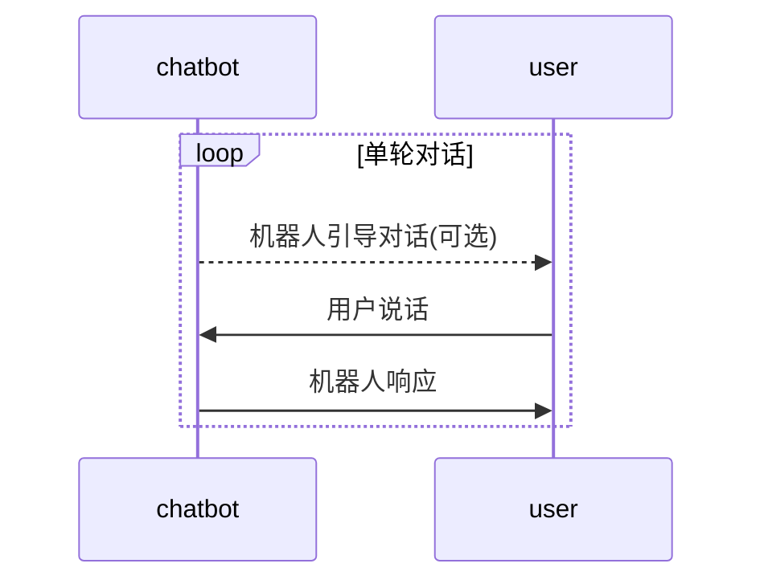
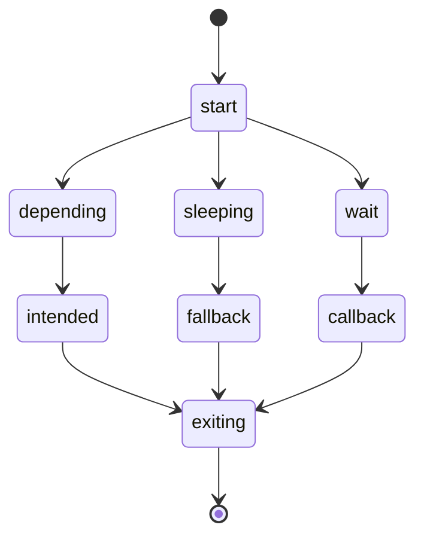
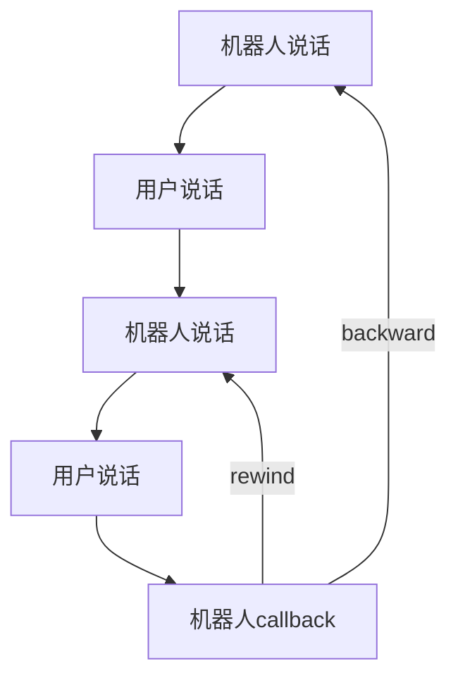
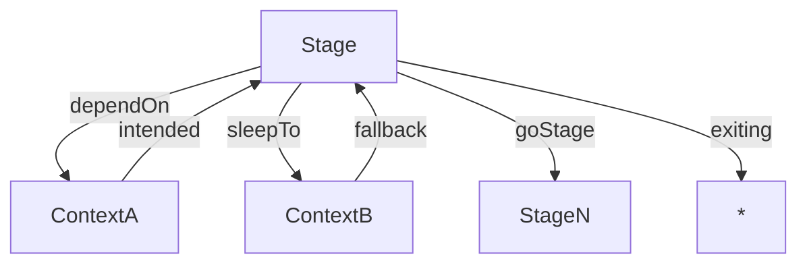

# Stage

> 在深入了解 Stage 之前, 建议您先阅读 [多轮对话的生命周期](/docs/dm-lifecircle.md) 和 [Context文档](/doc/dm/context.md).

## 1. 关于上下文逻辑

多轮对话最主要的特点, 就是参与对话的双方要轮流等待对方的响应.



如图所示, 一个个对话单元环环相扣, 构成一个锁链形状的多轮对话历史轨迹.

而在机器人的```响应环节```, 如图所示, 有两件事情可做:

- 响应用户的话语
- 引导下一轮对话 (可选)

```响应环节```的逻辑, 我们称之为上下文逻辑, 它势必在一个上下文语境中驱动机器人去响应. 而这种上下文逻辑, 在 CommuneChatbot 中通过 Stage 来定义.


## 2. 定义 Stage

Stage 的 Interface 是```Commune\Chatbot\OOHost\Context\Stage```. 定义 Stage 最基本的做法是在 Context 类中创建方法 :

```php
class MyContext extends OOContext
{

    // 用 __on 作为 stage 方法的前缀
    // stage 的名称为 'start'
    // 所有 Context 默认的 stage 就是 'start', 是多轮对话的起点
    //
    public function __onStart(Stage $stage) : Navigator
    {
        ...
    }

    /**
     * @stage
     * 使用 "@stage" 注解同样可以定义 Stage. 方法名就是 stage 的名称
     * 但不建议用这种方法, 因为在阅读代码时, 没有 __on 前缀的做法辨识度高
     *
     * @param \Commune\Chatbot\OOHost\Context\Stage $stage
     * 入参是 Stage 对象, 必填. 强类型既方便 IDE 识别, 又方便排查问题
     *
     * @return \Commune\Chatbot\OOHost\Directing\Navigator
     * 返回结果是一个 Navigator 对象. 每一个 Stage 都必须返回.
     */
    public function stageA(Stage $stage) : Navigator
    {
        ..
    }
}
```

> 一个 Context 类中可以定义的 Stage 没有数量限制, 但显然定义太多不方便维护, 推荐拆分成若干个 Context 嵌套.

### 2.1 使用 callable 作为回调逻辑

Stage 用来管理上下文逻辑, 而这些逻辑都是用 callable 的形式注册到各种回调方法中.

需要注意 :

1. callable 的各种形式都是合法的
1. callable 都自动进行依赖注入
1. callable 返回结果必须是 ```Null``` 或者```Commune\Chatbot\OOHost\Directing\Navigator```

```php

public function __onStart(Stage $stage) : Navigator
{

    return $stage
        // 使用闭包作为 callable
        ->onStart(function(Dialog $dialog){
            ...
        })
        ->talk(
            // 使用 [$object, 'methodName'] 作为 callable
            [$this, 'startAction'],

            // 使用 ['className', 'methodName'] 作为 callable
            [Handler::class, 'hanlde']
        );
}

// 定义一个动态方法, 作为 callable 对象.
// 依赖注入时, 允许传入 CacheAdapter 等各种注册到 IoC 容器中的服务
// 返回结果需要是 null 或者 Navigator
// 用这种做法可以封装代码, 更加清晰
//
public function startAction(Message $message, Dialog $dialog, CacheAdapter $cache) : ? Navigator
{
    ...
}

```

### 2.2 使用 Hearing API

[Hearing API](/docs/dm/hearing.md) 通常用于 Stage 的 callback 状态, 用于定义响应消息的逻辑. 实际上 Hearing API 在任何能拿到 Dialog 对象的 callable 中都可以使用.

```php

public function __onStart(Stage $stage) : Navigator
{

    return $stage
        // 使用闭包作为 callable
        ->onStart(function(Dialog $dialog){

            // 将当前对话的用户消息作为 对象
            $message = $dialog->session->incomingMessage->message;
            return $dialog->hear($message)
                ...
                ->end();
        })
        ->onIntended(function(Context $callbackContext, Dialog $dialog) {

            // 将回调的 Context 视作 Message 传入
            return $dialog->hear($callbackContext)
                ...
                ->end();
        })
        ->talk(
            ...,
            function(Dialog $dialog) {

                // 默认使用用户消息
                return $dialog->hear()
                    ...
                    ->end();
            }
        );
}

```

具体的 API 请查阅[相关文档](/docs/dm/hearing.md).

### 2.3 注册到 Definition

在 Context 中定义的 Stage 方法会被抽取成 callable 对象, 传给 ContextDefinition (```Commune\Chatbot\OOHost\Context\Definition```) 单例持有. 真正的 Stage 对象都由 ContextDefinition 操作 :

```php

    $contextDefinition = $context->getDef();

    $contextDefinition->hasStage($name); // 是否存在
    $contextDefinition->getStageNames(); // 获取所有的 Stage

    // 通过 ContextDefinition 运行 Stage 的各种状态
    $contextDefinition->startStage($context, $dialog, $stageName);
    $contextDefinition->intendedStage($context, $dialog, $stageName);
    $contextDefinition->callbackStage($context, $dialog, $stageName);
    $contextDefinition->fallbackStage($context, $dialog, $stageName);
    $contextDefinition->callExiting($event, $context, $dialog);
```

由此可知, 即便在 Context 内没有定义一个 Stage, 只要在响应的 ContextDefinition 内定义了, 该 Stage 同样存在. 这种做法特别适合 __用配置文件定义上下文__.

## 3. 单次响应的状态变更

Stage 相当于多轮对话状态机的一个状态, 是对话历史轨迹中的一个节点. 而一次```响应环节```, 可能途经若干个 Stage 节点. 看下面这个例子

```
// 上一轮对话的引导语
机器人: 请问如何称呼您

// 用户的回复
用户: 烈风

// 机器人的回复
机器人: 您好啊, 烈风

// 下一轮对话的引导语
机器人: 请问我有什么可以帮您
```

落实到代码中, 可以有各种实现方式. 让我们看看下面这种实现方式:

```php

    // askUserName 节点
    // 询问用户姓名
    public function __onAskUserName(Stage $stage) : Navigator
    {
        return $stage->buildTalk()
            ->askVerbal('请问如何称呼您')

            ->hearing()

            // 用户回答后, 进入 welcome 节点
            ->isAnswer(function(Dialog $dialog) {
                ...
                return $dialog->goStage('welcome');
            })
            ->end();
    }

    // welcome 节点
    // 向用户问好之后, 直接进入 menu节点
    public function __onWelcome(Stage $stage) : Navigator
    {
        // 向用户问好
        $stage->dialog->say()->info("您好啊, %name%", ['name'=>$this->name]);

        // 进入menu 节点
        return $stage->dialog->goStage('menu');
    }

    // menu 节点
    public function __onMenu(Stage $stage) : Navigator
    {
        // 询问用户需要做什么
        return $stage->buildTalk()
            ->askChoose(
                '请问我有什么可以帮您?',
                $menu
            )
            ->hearing()
            ...
            ->end();
    }

```

在这个例子中, 用户回答 "烈风" 后, 机器人的响应逻辑途经了三个 Stage, 改变了四次状态, 依次是

- __onAskUserName::callback
- __onWelcome::start
- __onMenu::start
- __onMenu::wait

在机器人的上下文响应逻辑中, 除了退出对话的情况, 多轮对话状态一定会前进到某一个 ```Wait```为止, 等待用户下一次输入.

## 4. Stage 的多种状态

Stage 的工程设计理念是: 只定义一套代码, 描述所有状态.

事实上多轮对话进入一个 Stage 有许多种情况, 每种情况的响应逻辑都不一样. 状态变化如图所示 :



+ 启动状态
    - start : 多轮对话进入一个 Stage 时触发
+ 等待状态
    - wait : 等待用户回复
    - depending : 依赖另一个 Context 的结果, 等待中
    - sleeping : 等待别的话题结束后, 睡眠中
+ 回调状态
    - callback : 用户发来消息并响应
    - intended : 依赖的 Context 结束, 并回调
    - fallback : 别的话题结束后, 回调
+ 跳转
    - goStage : 前进到同一个 Context 内的另一个 Stage
+ 退出 (exiting)
    - fulfill : 结束当前 Context, 触发回调
    - cancel : 取消掉当前 Context, 整体退出
    - failure : 当前 Context 出错, 整体退出
    - reject : 拒绝用户访问对话, 整体退出

其中等待状态和回调状态是成对出现的 :

- wait & callback
- depending & intended
- sleep & fallback

定义各种状态下的一般逻辑, 可以用这种形式 :

```php

public function __onStart(Stage $stage) : Navigator
{
    $stage
        // start 状态下执行的逻辑
        ->onStart( $callable )
        ->onStart(...)

        // callback 状态下执行的逻辑
        ->onCallback(...)
        ->onCallback(...)

        // fallback 状态下执行的逻辑
        ->onFallback(...)
        ->onFallback(...)

        // intended 状态下执行的逻辑
        ->onIntended(...)
        ->onIntended(...)

        // exiting 状态执行的逻辑
        ->onExiting(...)
        ->onExiting(...);

    return $stage->navigator;
}
```

Stage 链式调用里传入的各种 callable 对象, 只在符合状态的时候执行, 不是指定状态下则不执行. 而且无论链式调用注册了多少个方法, 只执行到第一次接受到 Navigator 返回值的位置.

```php
public function __onStart(Stage $stage) : Navigator
{
    // 最终只会执行到第二步
    $stage
        ->onStart(function(Dialog $dialog) {
            // 说 'method1'
            $dialog->say()->info('method1');

            // 没有 navigator 回调
            return null
        })
        ->onStart(function(Dialog $dialog) {
            // 说 'method2'
            $dialog->say()->info('method2');

            // 有 navigator 回调
            return $dialog->wait();
        })
        ->onStart(function(Dialog $dialog) {
            // 说 'method3'
            $dialog->say()->info('method3');

            // 有 navigator 回调
            return $dialog->wait();
        }

    return $stage->navigator;
}
```

### 4.1 最少状态封装

一个 Stage 可以定义所有的状态变更逻辑. 但这样会导致可读性和维护性都下降. 我们强烈鼓励一个 Stage 尽可能做封装最少的状态, 只处理一组成对的状态变更, 更复杂的状态变更则通过多个 Stage 来实现.

为此, Stage 提供了三组方法 :

- ```Stage::talk($onStart, $onCallback)```
- ```Stage::sleepTo($target, $onFallback)```
- ```Stage::dependOn($target, $onIntended)```

例如:

```php

class MyContext extends OOContext
{

    // 与用户进行对话的 Stage
    // 只有 start, wait, callback 三种状态
    public function __onStart(Stage $stage) : Navigator
    {
        return $stage->talk(
            $start,             // onStart 状态逻辑
            $callbackCallable   // onCalback 状态逻辑
        );
    }

    // 处理依赖关系的 Stage
    // 只有 start, depending, intended 三种状态
    public function __onDepend(Stage $stage) : Navigator
    {
        return $stage->dependOn(
            $dependContext,   // 依赖的 Context, 跳转的对象
            $intendedCallable // onIntended 状态逻辑
        );
    }

    // 处理 sleep 跳转关系的 Stage
    // 只有 start, sleeping, fallback 三种状态
    public function __onSleep(Stage $stage) : Navigator
    {
        return $stage->sleepTo(
            $targetContext,     // 跳转的目标 Context
            $fallbackCallable   // onFallback 时的回调逻辑
        )
    }
}

```


## 5. 多轮对话调度

通过 Stage 来调度多轮对话状态, 有多种方法, 大致分为以下几类 :

1. 自旋 : 维持当前 Stage 不变
1. 不可回溯跳转 : 跳转到另一个节点, 并不返回
1. 可回溯跳转 : 对话暂时跳转走, 但终将跳转回本节点
1. 退出机制 : 退出当前的 Context
1. 回溯历史 : 沿对话轨迹回退

所有这些调度, 都通过 Dialog(```Commune\Chatbot\OOHost\Dialogue\Dialog```)对象返回 Navigator(```Commune\Chatbot\OOHost\Directing\Navigator```) 来操作.

### 5.1 Stage 自旋

自旋指下一轮对话时, Stage 不变. 通常有以下方法:

- ```Dialog::wait()``` : 等待用户消息
- ```Dialog::repeat()``` : 重复当前 Stage, 进入 start 状态

```php
public function __onStage(Stage $stage) : Navigator
    return $stage->buildTalk()
        // 用提问引导用户
        ->askVerbal(...)

        // 回调逻辑
        ->hearing()

        ->expect(
            $condition1,
            function(Dialog $dialog) {
                ...

                // 用当前的 Stage 等待用户输入
                return $dialog->wait();
            }
        )

        ->expect(
            $condition2,
            function(Dialog $dialog) {
                ...

                // 重复当前 Stage, 进入 Start 的状态
                // 将重新对用户提问.
                return $dialog->repeat();
            }
        )

        ->end();
}
```

### 5.2 Stage 不可回溯跳转

让当前 Stage 跳转到指定的 Stage, 但无需返回. 通常有以下方法 :

- ```Dialog::goStage()``` : 前往一个指定的 Stage
- ```Dialog::goStagePipes()``` : 前往多个 Stage 构成的管道
- ```Dialog::restart()``` : 回到当前 Context 的 __onStart 方法
- ```Dialog::replace()``` : 替换当前的 Context, 或 Thread, 甚至 Process
- ```Dialog::home()``` : 返回整个多轮对话的起点.

```php
public function __onStage(Stage $stage) : Navigator
    return $stage->buildTalk()
        // 用提问引导用户
        ->askVerbal(...)

        // 回调逻辑
        ->hearing()

        ->expect(
            $condition1,
            function(Dialog $dialog) {
                ...
                // 前往指定 stage
                return $dialog->goStage('stageName');
            }
        )

        ->expect(
            $condition2,
            function(Dialog $dialog) {
                ...
                // 前往 stage 管道
                return $dialog->goStagePipes(['stage1', 'stage2', 'stage3']);
            }
        )

        ->expect(
            $condition3,
            function(Dialog $dialog) {
                ...
                // 返回当前 Context 的 __onStart() 方法
                return $dialog->restart();
            }
        )

        ->expect(
            $condition4,
            function(Dialog $dialog) {
                ...
                // 返回整个多轮对话的起点
                return $dialog->home();
            }
        )

        ->end();
}
```

```Dialog::replace()``` 方法可以用指定的 Context 替换掉当前的 ```Node```, ```Thread``` 甚至 ```Process```, 需要您了解 [多轮对话生命周期](/docs/dm-lifecircle.md), 具体使用方法请查阅源代码.


### 5.3 Stage 可回溯跳转

可回溯跳转, 指的是当前 Stage 跳转到另一个 Context, 按正常逻辑走下去, 未来会跳转回来. 目前可回溯跳转主要是 :

- ```Dialog::$redirect->dependOn()``` : 依赖一个 Context, 将之作为回调, 并共享退出机制
- ```Dialog::$redirect->sleepTo()``` : 跳转到一个 Context, 当对方结束时回调.


```php

    public function __onDepend(Stage $stage) : Navigator
    {
        // 依赖跳转关系
        return $stage->dependOn(

            // 指定跳转的目标 Context
            // 允许用 Context 的类名, 实例, ContextName 作为参数
            // 会进入目标 Context, 从 Entity 逻辑到 __onStart 方法.
            //
            MazeInt::class,

            // onIntended 时执行的逻辑
            // 当 MazeInt 调用了 fulfill 方法后, 返回.
            // 跳转对象 MazeInt 将作为依赖注入参数, 回调.
            //
            // 如果 MazeInt 因为 cancel, reject, failure 等机制退出
            // 也会使当前 Context 退出
            //
            function(MazeInt $context, Dialog $dialog) {
                ...
            }
        );
    }

    public function __onSleep(Stage $stage) : Navigator
    {
        return $stage->sleepTo(

            // 指定跳转的目标 Context
            // 允许用 Context 的类名, 实例, ContextName 作为参数
            // 会进入目标 Context, 从 Entity 逻辑到 __onStart 方法.
            //
            new MazeInt,

            // onFallback 时执行的逻辑
            // 当 MazeInt 调用了 fulfill 方法后, 回调.
            // 如果 MazeInt 因为 cancel, reject, failure 等机制退出, 仍然回调.
            //
            function(Dialog $dialog) {
                ...
            }
        )
    }


```

### 5.4 退出机制

退出机制, 指从当前 Context 退出, 并不关心下一步是什么. 下一步由系统历史轨迹决定. 通常有以下方法:

- ```Dialog::fulfill``` : 从当前 Context 中退出.
    - 当前 Context 是多轮对话起点 : 退出整个多轮对话.
    - 当前 Context 被依赖 : 用 intended 事件回调依赖方.
    - 当前 Context 无依赖 : 唤醒最近一个 sleeping 状态的 Context
- ```Dialog::next()``` : 如果指定了 Stage 管道, 就进入下一个 Stage, 否则 fulfill
- ```Dialog::quit()``` : 主动退出整个多轮对话.
- 异常退出
    - ```Dialog::cancel()``` : 用户主动取消了任务
    - ```Dialog::reject()``` : 用户没有对话的权限, 系统自己取消了任务
    - ```Dialog::failure()``` : 系统发生了故障, 退出任务.

注意, 异常退出是可以拦截的, 需要通过 ```Commune\Chatbot\OOHost\Context\Exiting``` 定义拦截逻辑.

```php

public function __onSomeStage(Stage $stage) : Navigator
{
    return $stage

        // 如果触发了退出事件.
        ->onExiting(function(Exiting $exiting) : void {

            // 通过链式调用传入 callable, 进一步定义退出事件的拦截逻辑
            $exiting

                // 拦截方法示例一, 变更事件
                ->onReject(function(Dialog $dialog) {

                    // 拦截掉 reject, 不退出, 反而进入另一个 Stage
                    return $dialog->goStage('whenReject');
                })

                // 拦截方法示例二, 不变更事件
                ->onCancel(function(Dialog $dialog) {

                    // 拦截时并不变更逻辑, 只是给用户一个回复
                    $dialog->say()->warning('任务取消!');

                    // 在退出事件内部调用同名的退出方法,
                    // 必须传入 $skipSelfExiting = TRUE,
                    // 跳过自身的拦截机制, 避免死循环.
                    $skipSelfExiting = true;
                    return $dialog->cancel($skipSelfExiting);
                })
                ->onQuit(...)
                ->onFulfill(...);
        })

        // 依赖另一个 Context
        ->dependOn(
            ...
        );
}

```

> 注意, Stage 自身的退出事件也可以被自身拦截, 开发者要注意避免死循环.

退出事件拦截机制更详细的定义, 请查看```Commune\Chatbot\OOHost\Context\Exiting```源码.

### 5.5 回溯历史

回溯历史并非 "前进" 到某一个节点, 而是退回到多轮对话之前的某一个节点, 将上下文状态也还原回去. 有点类似于浏览器上的 "后退" 功能.

最常见的情况, 就是机器人问用户一个信息, 用户口误说错了, 想返回上一步重新说一次.

这个功能看起来简单, 实际上非常困难. 线性逻辑的回退好比上楼梯下楼梯, 所以看起来简单. 但多轮对话经历了复杂的状态改变, 保存的是结果而非过程, 就像一个魔方. 这种回退更像是把魔方还原.

百分之百无副作用的 "Undo" 很难实现, 但上下文状态回退 "backward" 是可以实现的. CommuneChatbot 用了笨办法, 将多轮对话每一帧的上下文状态, 都保存为一个快照 (```Commune\Chatbot\OOHost\Session\Snapshot```), 在回溯历史时, 只要之前的快照存在, 就可以还原回去.

回退上下文常用的方法有两个 :

- ```Dialog::rewind()``` : 当用户这一轮对话没有说
- ```Dialog::backward()``` : 回到上一轮对话



我们举两个对话的例子来更直观的理解:

Dialog::rewind :

```
机器人: 请问您的姓名

用户: 烈风

机器人: 请问您的年龄

用户: 张三

机器人: 对不起, 请用数字表示年龄
// 触发了 rewind, 重复刚才的问题
机器人: 请问您的年龄

```

Dialog::backward :

```
机器人: 请问您的姓名

用户: 列风

机器人: 请问您的年龄

用户: 不好意思, 刚才名字说错了

// 触发了 backward
机器人: 请问您的姓名

```

由于 Backward 之后还可以继续 Backward, 所以 Session 需要存储多个 Snapshot.

很显然, Snapshot 拥有较大的数据量, 每一帧都长期存储, 系统会迅速膨胀到崩溃.
我们可以通过机器人配置数组中的```$chatbotConfig->host->maxBreakpointHistory``` 中定义可 Backward 的步数, 超过这个步数的记忆就销毁掉, 使 Backward 变为 Rewind.

当然, 您也可以用更偏业务逻辑的办法, 定义出类似浏览器 Get 请求那样无状态的上下文, 用 ```Dialog::replace``` 等办法实现无副作用的 Undo.

### 5.6 状态图

Stage 的各种对话状态, 可以简单用下图表示:



## 6. Context 魔术方法

系统在 ```Commune\Chatbot\OOHost\Context\Context``` 类中定义了一批魔术方法, 可以方便各个 Stage 公共逻辑的定义.

常用魔术方法如下:

```php
<?php

use Commune\Chatbot\App\Contexts\TaskDef;

class MyTask extends TaskDef
{
    // 定义 Context 的依赖步骤, 这些步骤都进行后才会进入 __onStart
    public static function __depend(Depending $builder): void  {...} ;

    // 当前 Context 下每一个 Stage 都会调用的公共构建方法.
    // 可以提供公共逻辑, 例如每一步都检查用户是否有超级管理员权限
    public function __staging(Stage $stage) : void {...} ;


    // 当前 Context 所有的 Hearing API 公共的构建方法.
    // 可用来定义一些公共的对话指令, 例如 "退出"
    public function __hearing(Hearing $hearing) : void {...} ;

    // 当前 Context 公共的退出逻辑.
    // 可以在这里注册各种退出事件 (quit, cancel 等) 触发的响应.
    public function __exiting(Exiting $exiting) : void {...} ;

    // 当前 Context 公共的帮助逻辑.
    // 在任何一个 Stage 中, 当用户向机器人求助时,
    // 如果没有指定的 help 响应, 就尝试调用这个方法
    //
    public function __help(...) : ? Navigator {...};

```


## 7. Stage::buildTalk()

定义 Stage 最常用的逻辑就是 ```Stage::talk()```, 与用户对话.
我们常常只需要定义很简单的对话逻辑, 但需要写一大堆闭包 (PHP lambda 语法要到未来版本才引入 ).
因此设计了 ```Stage::buildTalk()```, 用强类型约束的链式调用来简化代码.

如果您使用成熟的IDE, 例如```PHPStorm```, 写起来会很流畅 :

```php

    public function __onStart(Stage $stage) : Navigator
    {
        return $stage
            // 定义 Stage 的正常逻辑
            ->onStart(...)

            // 启动 talk 的构建工具
            // 进入 Start 状态
            ->buildTalk( $commonSlots = [])
                // 直接定义说话内容
                ->info(...)
                ->warning(...)
                ->askChoose(
                    $question,
                    $choices,
                )
            // 进入callback, 直接使用 hearing api
            ->hearing()
                ->isChoice(1, ...)
                ->isChoice(2, ...)
                ->isPositive(...)
                ->isNegative(...)
            ->end();
    }
```

Builder 具体的用法请查看 ```Commune\Chatbot\OOHost\Context\Stages\OnStartStage``` .


## 8. 使用 Stage Component

定义 Stage 的逻辑常常会有重复, 重复的逻辑可以通过 "配置" 来生成. 由于 CommuneChatbot 的 Stage 是完全可编程的, 因此可以用高阶的逻辑生成低阶的逻辑, 从而实现 "配置化" 和 "动态语法".

Stage 提供 ```Stage::component()``` 方法, 允许把 Stage 的逻辑封装到别的 callable 对象中, 从而实现跨 Context 的复用.

```php

    public function __onStart(Stage $stage): Navigator
    {
        $menu = new Menu(
            '请您选择: ',
            [
                // 功能点测试 Context
                FeatureTest::class,
                // 欢迎用户 Context
                WelcomeUser::class,
                // 多轮对话形式的开发工具
                DevTools::class,
            ]
        );

        return $stage->component($menu);
    }

```

系统自带了一部分 Component 如下:

- 快速定义菜单 : ```Commune\Chatbot\App\Callables\StageComponents\Menu```
- 连续说话 : ```Commune\Chatbot\App\Callables\StageComponents\AskContinue```
- 分页菜单 : ```Commune\Chatbot\App\Callables\StageComponents\Paginator```

您可以查看源码了解用法, 也可以按需定义您自己的组件与人分享.


## 9. 子对话

在 [多轮对话生命周期](/docs/dm-lifecircle.md) 中, 我们介绍了 "子对话与多任务调度" 的概念. 这里不再重复.

完整的子对话管理可以通过 Stage 来定义. 示例如下:

```php
 /**
     *
     * 测试会话嵌套.
     * 测试子会话的各种功能.
     * 可以测试的点:
     *
     * 1. before : 父dialog 拦截到, 仍然进入子dialog
     * 2. stop  : 父dialog 拦截到, 不进入子dialog
     * 3. miss : 子dialog miss, 父dialog 返回拦截到
     * 4. quit : 子dialog quit, 父dialog 拦截到, 返回菜单.
     * 5. fulfill : 子dialog fulfill, 触发 quit
     * 6. next : 子dialog 切换stage, 直到触发 fulfill
     * 7. maze : 子dialog 进入迷宫游戏
     * 8. stage : 查看子dialog 的stage
     *
     * @param Stage $stage
     * @return Navigator
     */
    public function __onTestSubDialog(Stage $stage): Navigator
    {
        return $stage
            // 正常的stage事件.
            ->onStart(function(Dialog $dialog){
                $dialog->say()->info('sub dialog start');
            })
            ->onCallback(function(Dialog $dialog){
                $dialog->say()->info('sub dialog callback');
            })
            ->onFallback(function(Dialog $dialog){
                $dialog->say()->info('sub dialog fallback');
            })

            // 开启 sub dialog
            ->onSubDialog(
                $this->getId(),
                function(){
                    return new SubDialogCase();
                }
            )
            // 进入子会话之前.
            ->onBefore(function(Dialog $dialog){
                return $dialog->hear()
                    ->is('before', function(Dialog $dialog){
                        $dialog->say()->info('hit before');
                        return null;
                    })
                    ->is('menu', function(Dialog $dialog) {
                        $dialog->say()->info('stop sub dialog and go start');
                        return $dialog->restart();
                    })
                    ->heardOrMiss();
            })
            // 子会话 wait 时
            ->onWait(function(Dialog $dialog){
                $dialog->say()->info('sub dialog is wait');
                return $dialog->wait();
            })
            // 子会话 miss 时
            ->onMiss(function(Dialog $dialog){
                $dialog->say()->info('sub dialog miss match');
                return $dialog->hear()
                    ->is('miss', function(Dialog $dialog){
                        $dialog->say()->info('catch miss');
                        return $dialog->wait();
                    })
                    ->end();
            })

            // 子会话退出时.
            ->onQuit(function(Dialog $dialog){
                $dialog->say()->info('sub dialog want quit');
                return $dialog->restart();
            })
            ->end();
    }
```

具体的定义方式, 可以查阅源码 ```Commune\Chatbot\OOHost\Context\Stages\SubDialogBuilder```.