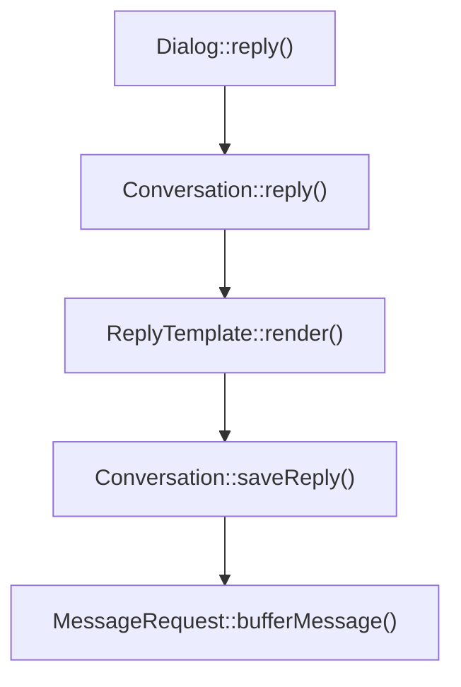

# 多平台适配

CommuneChatbot 的设计理念是, 同一个机器人的对话逻辑 (通过 Host 实现) 可以部署到多个平台上, 尽可能实现跨平台的适配.

由于项目在初期阶段, 所以支持的平台有限, 目前初步实现支持的平台有 :

- 命令行
- 网页版
- 微信公众号
- 百度智能音箱

正常情况下, 您只要选择支持平台的类库, 加载到配置文件中, 就能使机器人在该平台适用. 平台适配的类库将独立进行版本更新, 用于跟随平台功能发展.

本节主要讨论如何给一个平台开发适配类库.

## 1. 适配概述

在讨论平台适配时, 我们需要了解适配一个平台的三个方面工作 :

1. 搭建服务端实例, 能监听通信 ( http, tcp, 消息通道等等 )
1. 从通信协议中, 解析出平台请求, 并负责渲染和发送响应
1. 将机器人的通用回复, 转化为平台的专属回复

对应三个工程模块

- 服务端实例 : ```Commune\Chatbot\Contracts\ChatServer```
- 请求封装 : ```Commune\Chatbot\Blueprint\Conversation\MessageRequest```
- 消息渲染 : ```Commune\Chatbot\Blueprint\Conversation\Renderer```

用收信件来比喻的话 :

- 服务端实例 : 相当于屋子外的信箱, 让邮递员投递信件
- 请求封装 : 相当于信封和信纸
- 消息渲染 : 相当于打印机

要实现对一个平台的完美适配, 这三个方面都需要顾全到.

## 2. 封装 ChatServer

系统运行时, 使用服务端实例 ( ```Commune\Chatbot\Contracts\ChatServer```实例 ) 建立通信, 监听请求信息.

到来的请求在 ChatServer 内封装成 MessageRequest, 再交给 Kernel 去响应. 写成伪代码如下.

根应用启动 :

```php

// 获得机器人的配置数组
$chatbotConfig = include ... ;

// 生成机器人的实例
$chatApp = new Commune\Chatbot\Framework\ChatApp($chatbotConfig);

// 获取服务端的实例
$server = $chatApp->getServer();

// 服务端实例开始监听请求
$server->run();

```

### 2.1 循环监听请求

在 ```ChatServer::run()``` 方法中, 需要实现对请求的循环监听. 我们以 Swoole 为例:

```php

class HttpServer implements ChatServer
{
    /**
     * @var Swoole/Server
     */
    protected $server;
    ...


    public function run() : void
    {
        // 定义监听到请求的回调逻辑
        $this->server->on('receive', function ($server, $fd, $reactor_id, $data) {
            // 获取 App 的 Kernel
            $kernel = $this->app->getKernel();

            // 将请求封装为 MessageRequest
            $request = new SwooleUserMessageRequest(
                $server,
                $fd,
                trim($data),
                $config
            );

            // 让 Kernel 响应一个用户消息
            $kernel->onUserMessage($request);
        });

        // swoole server 开始运行
        $this->server->start();
    }
}
```

因此, 定义 ```Commune\Chatbot\Contracts\ChatServer``` 实际上就是定义机器人的通信机制. 这个通信可能来自于 TCP 通信, 消息通道, 甚至 StdIO ... 都可以, ChatApp 并不关心具体的实现.

### 2.2 注册 ChatServer

ChatServer 对于系统而言是必要的, 而且必须是进程级单例.

但系统并没有指定注册 ChatServer 的地方, 通常可以在机器人配置数组的 ```$chatbotConfig->processProviders``` 数组中自行注册唯一服务即可.

任何可以依赖注入的地方, 都可以通过 ```Commune\Chatbot\Contracts\ChatServer``` 接口从 IoC 容器中获取服务端实例.

### 2.3 异常机制

ChatServer 定义了两种异常处理机制, 分别是:

- 整体故障 : ```ChatServer::fail()```
- 关闭客户端 : ```ChatServer::closeClient($conversation)```

CommuneChatbot 运行过程中会调用到到这两种抽象的方法.

__整体故障__ : 通常是开发者留下了严重的 bug, 导致每一个消息请求都受影响, 系统不应该继续运行下去.

__关闭客户端__ : 与单个用户的通信出现了严重的问题, 导致对话无法继续下去. 这个问题可能来自 BUG, 也可能来自业务逻辑. 系统默认的解决方案是关闭客户端连接 (如果有长连接的话), 重置会话历史回到起点.

这两个处理方法, 在不同的通信平台上的具体实现可能截然不同, 请自行判断合理的逻辑.

### 2.4 在 Studio-hyperf 中定义 ChatServer

如果用 [studio-hyperf 工作站](https://github.com/thirdgerb/studio-hyperf) 来开发平台适配, 还需要多定义一层 Server.

这是因为系统改用 [Hyperf 框架](https://www.hyperf.io/) 来启动, 需要有一个 Hyperf Server 类来定义对 Swoole Server 各种监听事件的响应.

因此项目启动时可能同时有三种 Server :

- Swoole Server
- Hyperf Server
- CommuneChatbot Server

它们之间的具体关系, 可以参考项目自带的 Web 应用, DuerOS 应用, 微信公众号应用的实现方法.


## 3. 封装 MessageRequest

```Commune\Chatbot\Blueprint\Conversation\MessageRequest``` 是对消息请求协议的封装. 详细 API 请查看源码.

它主要功能是 :

- 将平台请求协议, 解析成 CommuneChatbot 标准数据, 包括且不限于 :
    * Message : 消息的抽象, 见 [消息体系文档](/docs/engineer/messages.md)
    * Chat : 会话的抽象, 用来唯一定位由所有对话参与者组成的消息通道
    * User : 用户信息的抽象
    * NLU : 通信中携带的自然语言解析信息
- 将 CommuneChatbot 的标准数据, 根据协议渲染成平台的响应数据.

> 理论上, 一个 Message 封装一个 MessageRequest. 如果用户的消息可以拆分为多个 Message, 应该由 ChatServer 负责拆分为多个请求, 依次让机器人处理.

在 [studio-hyperf 工作站](https://github.com/thirdgerb/studio-hyperf) 所使用的 MessageRequest, 通常继承自```Commune\Hyperf\Foundations\Requests\AbstractMessageRequest```, 提供了一些通用的封装逻辑, 可以考虑使用.

它最大的特点是使用了```Commune\Hyperf\Foundations\Contracts\MessageQueue``` 来缓冲需要输出给用户的数据, 相当于一个收件箱.

基于 MessageQueue, 可以实现简单的延时发送和容错 (防止消息丢失).

### 3.1 机器人自身信息

在 MessageRequest 中通过两个方法来定义机器人自身 :

* ```MessageRequest::getChatbotName()``` : 唯一标识机器人身份, 并且影响缓存. 通常就是配置中的```$chatbotConfig->chatbotName```.
* ```MessageRequest::getPlatformId()``` : 标记平台的唯一ID, 使得同一个机器人在不同平台的会话也是隔离的.

这两个参数决定了 Chat 所在的维度, 需要了解周全它们的作用.

### 3.2 Chat

"Chat" 是一个抽象的概念, 它决定了一个对话所有的参与者. 它可能是 QQ 上的 "好友", 也可能是 "群聊", 也可能是 "聊天室", 不一而足.

对于机器人而言, 它同时可以接入 N 个 Chat; 但每一个 Chat 对接的用户有多少, 它同一时间只能接受一条消息, 并结合上下文来响应. 这是 Chat 最核心的功能之一.

有可能影响 Chat 的维度都由 MessageRequest 来决定, 通常是 :

* PlatformId
* UserId
* ChatbotName

CommuneChatbot 自动根据这三个参数生成一个 Hash 值来标识唯一的 Chat. 如果您希望用自己的维度, 或用更安全的方法定义 ChatId, 可以通过 MessageRequest::getChatId() 来定义.

### 3.3 接受回复

当机器人通过 ```Commune\Chatbot\OOHost\Dialogue\Dialog``` 的 API 发送回复时, 回复通过了以下路径:



走到 ```MessageRequest::bufferMessage($outgoingMessage)``` 时, MessageRequest 通常有三种选择 :

- 立即渲染, 发送 : 仅仅在双工的通信中可行
- 立即渲染, SendResponse() 时发送
- 先 Buffer 起来, SendResponse() 时再渲染, 发送.

渲染环节需要把 CommuneChatbot 的消息抽象, 解析为通信通道的协议格式并发送.

> 协议尚不兼容的消息, 如果是输入消息, 可以用 ```Commune\Chatbot\Blueprint\Message\UnsupportedMsg``` 来通知机器人.
> 如果是输出消息, 也请考虑用某种方式告知用户收到了一个不支持的消息, 避免出现幻觉.

### 3.4 发送响应

MessageRequest 有三种协议层级的响应逻辑:

* ```MessageRequest::sendResponse()``` : 正常响应
* ```MessageRequest::sendRejectResponse()``` : 校验不通过, 认为是非法请求, 拒绝响应
* ```MessageRequest::sendFailureResponse()``` : 服务端严重问题, 无法发送任何正常响应. 只能发送协议中定义的异常通知.

它们的调度逻辑定义在 ```Commune\Chatbot\App\ChatPipe\MessengerPipe```, 注册在机器人配置数组里. 您可以按自己的方式替换掉系统的默认实现.

对请求的校验方法是 ```MessageRequest::validate()```, 各种加解密, 安全性相关的校验可以放在这一步.

### 3.5 机器人对接

CommuneChatbot 服务端的上游不一定对接客户端, 可能对接另一个对话机器人系统, 例如百度对话机器人 (智能音箱).

这样的上游机器人, 通常有自己的 SessionId, MessageId 等. 可以通过 MessageRequest 相关方法直接传过来.

### 3.6 追踪

CommuneChatbot 作为机器人服务端, 可能只是整个大型应用的一环. 因此有一些参数关系到调用链追踪 :

* ```MessageRequest::fetchTraceId()```
* ```MessageRequest::fetchMessageId()```

需要记录到日志里的追踪信息, 可以通过```MessageRequest::getLogContext()``` 方法自定义.

### 3.7 场景

同一套机器人逻辑, 当用户从不同场景开启对话时, 机器人的第一反应应该是不同的. 例如对客服机器人, 用户从导购场景开始对话, 和从投诉场景开始对话, 显然有明显的目的区别.

"场景" 概念决定了机器人用哪个 "根语境" (root context) 来响应用户, 可以通过 ```MessageRequest::getScene()``` 方法来定义.

更多相关信息请看 [多轮对话生命周期](/docs/dm-lifecircle.md).


## 4. 回复渲染

在做平台适配的时候, 还应该考虑回复的渲染. 这里举一个具体的例子 :

当我们定义了一个对话机器人, 它在微信公众号和智能语音平台提供相同的服务. 微信公众号提供的是纯文字的响应;
而在语音平台, 却要使用 [SSML 机制](https://www.w3.org/TR/speech-synthesis/)提供 XML 的响应.

这时机器人可以发送高度抽象的回复消息:

```php

    $dialog->say($slots = [
            'slot1' => $value1,
            'slot2' => $value2,
            ...
        ])
        // 使用 reply id 来标记一个回复
        ->info('sceneA.taskB.welcomeuser')
        ->info('sceneA.taskB.whatCouldIDo')
        ...
```

这样的消息作为 ```Commune\Chatbot\Blueprint\Message\ReplyMsg``` 发送给平台注册的 ```Commune\Chatbot\Blueprint\Conversation\ReplyTemplate``` 进行渲染.

只要不同平台通过机器人配置文件, 注册了不同的渲染, 就能生成不同的响应内容了. 具体请查阅 [渲染回复相关文档](/docs/engineer/replies.md).

